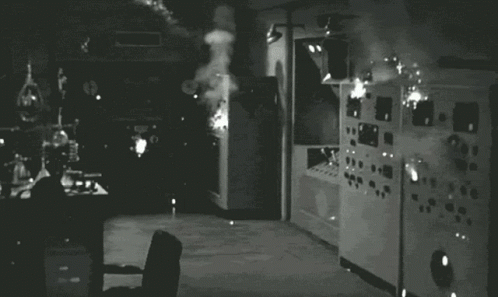

 <small><i>Shoutout to our overworked servers and runners.</i></small>

Thanks to the hard work of @blendgit:askiiart{ target="_blank" rel="noopener noreferrer" }, and Rudra finally rebuilding the repo packages, the current versions of {{ reference("utils", "akshara") }} and {{ reference("utils", "blend-inst" ) }} have some new fixes!
<!-- more -->

For one, AUR packages that install to `/opt` work again (just copy `/opt` the same way we copy `/etc`)! This change had been merged [a while back](https://git.blendos.co/blendOS/system-tools/akshara/-/commit/e14cc419a0ed570b4bad8483459abefaf6d76053){ target="_blank" rel="noopener noreferrer" } but hadn't been built until now.

Secondly, {{ reference("utils", "akshara") }} [will now](https://git.blendos.co/blendOS/system-tools/akshara/-/commit/27da28ccca90da2ed4a412eef7f4c11d6b1552f0){ target="_blank" rel="nopener noreferrer" } download the Arch filesystem tarball from your `#!yaml arch-repo:` setting. So if the default mirror is down, you can switch to another one and still be able to update!

{{ reference("utils", "akshara") }} [will now also](https://git.blendos.co/blendOS/system-tools/akshara/-/commit/cba45e457ec5d915e7471a465230770a2e27eb48){ target="_blank" rel="noopener noreferrer" } delete leftover files if it exits unexpectedly due to an error or a user pressing ++ctrl+c++. There is also a new flag to disable this behavior (see {{ reference("utils", "akshara") }} for details).

{{ reference("utils", "blend-inst") }} has [been fixed](https://github.com/blend-os/blend-inst/commit/cf1b6b54436549d2fe1ef3ef8dfd082429398b00){ target="_blank" rel="noopener noreferrer" }, removing a bug that wasted about 1GB of space during partitioning.

A new ISO version is out with the installer update, should reach all mirrors soon.

??? quote "P.S.: Repo Postmortem"
    The main `breakfast` repo was down because our Cloudflare encryption setting (Flexible) conflicted with the server's lack of support for unencrypted HTTP. This has been fixed.