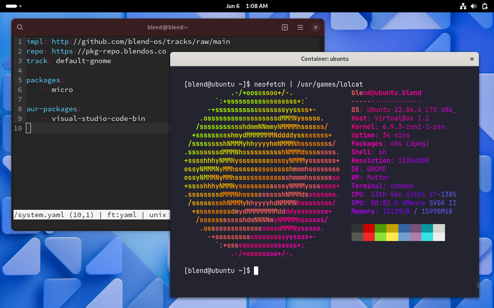

Download it here: https://blendos.co/download/

We're thrilled to unveil blendOS v4, a groundbreaking release that redefines blendOS as a **highly-flexible**, **immutable** and **atomic** variant of **Arch Linux**. blendOS retains the flexibility of traditional Linux distributions (unlike other immutable Linux distributions) thanks to its **declarative** nature. Of course, we continue to support packages from Ubuntu, Fedora, Debian and other distributions, alongside Android application support. You can also use any desktop environment available in the Arch Linux repositories or AUR, or any of the offered pre-configured desktop environments (including KDE Plasma, MATE, XFCE and Budgie) through the `tracks` features implemented on blendOS v4 (more on that later).

<!-- more -->

v4 is also the first release of blendOS that is fully declarative, allowing you to have any packages, kernels or drivers from the Arch repos/AUR on a base Arch system, while shipping pre-configured GNOME, KDE, XFCE, MATE and Budgie tracks if you'd like not to deal with the hassle of setting everything up yourself.

A single file, `/system.yaml`, is used to define everything on your system.

```yaml
# A sample /system.yaml

repo: 'https://pkg-repo.blendos.co/'

impl: 'https://github.com/blend-os/tracks/raw/main'

track: 'default-gnome'

packages:
    - 'micro' # the best text editor out there, truly ;)
    - 'firefox'
    - 'caddy'
    - 'nvidia-dkms'

aur-packages:
    - 'visual-studio-code-bin'

services:
    - 'caddy'
```

The above configuration, for example, allows you to have a blendOS installation with GNOME, Firefox, the Caddy web server, and Visual Studio Code.

You can now use **any** desktop environment/kernel/package from the Arch repositories/AUR by replacing the track variable with `blendos-base` and adding the packages for the desktop environment/kernel/other packages to the packages list in `/system.yaml`, essentially delivering an atomic Arch Linux system with a package set of your choice. Or, you can simply replace `default-gnome` with `xfce`, `mate`, `plasma` or `budgie`.

The System GUI-based application & `user` CLI utility allow you to create Ubuntu, Debian, Fedora and CentOS Stream containers. Simply opening a DEB/RPM/APK file also automatically creates a container with the appropriate distribution and installs the package file to it. This way, you can use programs from any of these distributions, which can also be accessed from the host shell. For instance, `apt` in a Debian container named `deb` can be accessed and used in the host shell as `apt.deb`. Any applications (GUI or CLI) open within containers are indistinguishable from native applications installed on the host, and automatically appear in the app grid/launcher if you're using a desktop environment.

Android application support can be enabled through the System app, although it is only supported on Wayland desktop environments like GNOME and KDE Plasma.

Special thanks to Ray Vermey, our QA lead, Asterisk & Jaoheah for doing the docs, infra and community moderation, Noa Himesaka for helping with testing and creating the T2 (post-2018 Intel Macs) Linux variant of blendOS, SvGaming for helping with the docs, screenshots and bpkg, and last but definitely not the least, Tobiyo Kuujikai, our community moderator.
