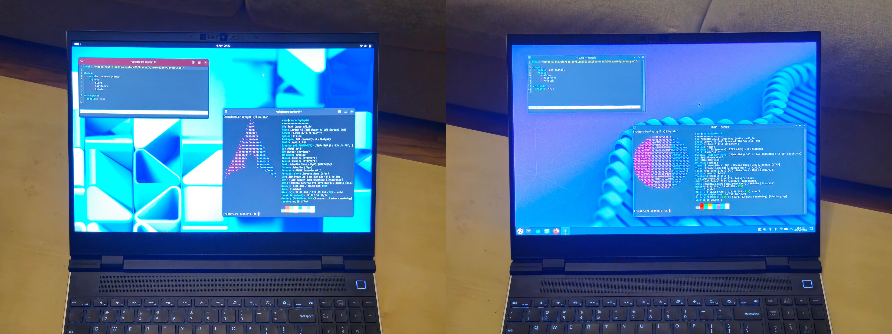

*This is a cross-post (republished verbatim) from my personal blog that was originally titled **'devlog: distro-switching & OCI system images in blendOS, collaboration with Framework, and a personal update'**; bearing the original description:*

> An account of how I implemented the ability to switch between distributions on blendOS and news of a collaboration with Framework, plus a personal update at the end.

*As such, certain sections of this blog post may not be directly relevant to the project.*

<!-- more -->

---

As I anticipate a great number of readers brought here by the news of an upcoming blendOS v5 release, the contents of this article shall be split in three sections – the first of these concerns itself with the news in question itself, alongside it an existing new collaboration with Framework; the second among these explores how we got here; and the lattermost of the lot conveys a more personal update.

## The Big News

On the left is pictured a Framework 16 running blendOS v5 on an Arch (GNOME) base, and on the right atop an Ubuntu (Plasma/Kubuntu) base:




All of that, driven alone by the change of a single line (maybe two) in a simple configuration file.

<hr />

As you may have well figured, blendOS v5 will include support for a variety of different distributions via a new extensible tracks system. At the time of writing, there have been implemented GNOME, Plasma, and headless tracks for Arch-based and Ubuntu-based blendOS systems each, switching between which entails changing a single line within one's `/system.yaml` file; and I have every intention of introducing support for several other distributions.

```yaml
#                                                  arch | ubuntu
#                                                       ↓
track: "https://git.blendos.co/blendOS/tracks/-/raw/v5/arch/gnome.yaml"
#                                                             ↑
#                                                    base | gnome | plasma
```
↑ *`/system.yaml` file*

Additionally, as part of our snazzy new `/system.yaml` configuration format, one may implement support for their own distributions of choice, building upon OCI images. For instance, illustrated underneath is the configuration for Ubuntu, based atop a custom Ubuntu container image (to reduce update times, though one could also use the pre-existing `ubuntu:latest` image from DockerHub for such a configuration): 

```yaml
--8<-- "https://raw.githubusercontent.com/blend-os/tracks/0e28a76b84bf4b83a4dea78dbadfdb7a74dc5057/ubuntu/base.yaml"
```

The new `/system.yaml` and track configuration format is to be documented over the forthcoming weeks, alongside an aggregator for community track configurations.

There can already be found installable testing ISOs [here](https://git.blendos.co/blendOS/image-builder/-/jobs/artifacts/v5/browse?job=build-job).

However, it is to be noted that despite the majority of core system functionality relating to track-switching being complete, the system as a whole remains under heavy development, and I would **STRONGLY** advise against using it as a daily driver; it is subject to significant internal change, and at the time of writing, only the Arch GNOME image has been tested to be entirely stable – the other tracks are comparatively somewhat lacking in terms of functionality (e.g. suspend issues, missing web browser OOTB), though one can expect that to change over the coming few weeks as development progresses.

### Collaboration with Framework

Earlier this year, the team at [Framework](https://frame.work/) had reached out to me about the possibility of introducing official blendOS support for their hardware; speaking as an advocate of repairable hardware, there could not have been obvious choice than to take on this collaboration – in an era marred by disposable electronics and planned obsolescence, the Framework 16 delivers a nonpareil extent of upgradability and extensibility.

I was subsequently supplied an HX 300-series Framework 16 last month, enabling me to work towards supporting the laptop as part of blendOS v5, aside from supplying the project with much-needed dedicated hardware for development; indeed, it is the very same laptop as that pictured above. As a new and upcoming Linux distribution, we greatly appreciate the support from Framework.

<hr />

## An Even Bigger Tale

It all began with the release of blendOS v4 – the first iteration of the project to introduce the signature `/system.yaml` configuration format.

```yaml
repo: 'https://pkg-repo.blendos.co/'
impl: 'https://github.com/blend-os/tracks/raw/main'
track: 'gnome'
packages:
    - 'micro'
    - 'caddy'
services:
    - 'caddy'
package-repos:
    - name: 'chaotic-aur'
      repo-url: 'https://cdn-mirror.chaotic.cx/$repo/$arch'
```
↑ *`/system.yaml` file from blendOS v4*

Unlike previous iterations of the project, it provided a configuration file enabling one to configure their system fully declaratively. However, this neither guaranteed reproducibility nor stability, and there had shortly been realised a need for a system more extensible than that offered; after all, one could only get so far with a handful of Pacman and AUR packages and commands. Additionally, as it existed, the system configuration file was limited to a base Arch rootfs and had no support for custom distributions, image/rootfs sources or the like. Besides, with the exception of its atomic nature, there existed limited guardrails built into the system to inhibit a user from utterly wrecking their computer.

Thus began an effort to produce a successor that utilised solely container images for this purpose by the name CommonArch, a project that had found itself within a continual cycle of development and stalling ever since the release of blendOS v4; yet, I had found limited success in introducing support for distributions other than Arch Linux, besides the obvious lack of system extensibility posed by such an implementation. At the end of the day, blendOS has always revolved around configurability to a greater extent than some other novice-friendly immutable distributions, as one may have come to expect at this point.

That all changed earlier this week, when there had occurred to me the possibility of supplying a distribution in possessorship of either update mechanism, or perhaps one that eliminated any such default, laying out the premise for blendOS v5; an alternative approach was considered more alike that offered presently on blendOS. Instead of relying exlusively upon a standard OCI image, such a container-based implementation could well be offered as a track itself for other distribution tracks to rely upon; and so the `oci.yaml` track sprang into existence, as provided underneath:

```yaml
--8<-- "https://raw.githubusercontent.com/blend-os/tracks/0e28a76b84bf4b83a4dea78dbadfdb7a74dc5057/oci/oci.yaml"
```

This, in tandem with a standard Arch track utilising a usual (cached) `pacstrap` invocation to generate an update root filesystem, allows us to offer an experience unperturbed by stability issues nearly as frequent, and certainly no longer plagued by anywhere near as many assumptions baked into our earlier update implementation.

In a nutshell, then, users now have the choice to opt between an exclusively container image-based system, one composed purely of standard system packages, or one of a hybrid nature; this choice has been abstracted away from novice users in a manner that is easily discoverable and configurable by those more familiar with such a system and/or those wishing to extend their system to lengths unimaginable with pre-existing novice-friendly atomic distributions.

<hr />

## A Long-Due Personal Update

It has been rather long since I last wrote one of these blog posts, and I shall, as such, take the liberty to hijack the remainder of this blog post with tales of my recent tribulations.

This past year has been a rather tumultous one – for one, I no longer reside in Wiltshire, instead encircled by the urban pastures of London (and the not-so-urban Surrey countryside, though unfortunately somewhat further off). Moreover, the increased academic pressure of the A-levels certainly has caught up to me, as I bid goodbye to the bygone days of the GCSEs (and alongside it, my time at an online independent school) to welcome a state school (well, a grammar school) into my life for the first time ever; even so, my prep school and public school days are certainly well behind me at this point, their role in my life displaced by the gruelsome scholastic pursuits of this newfound selective environment.

All of this takes us to the present day, where I find myself fully engrossed in this project in spite of my upcoming Year 12 mock examinations the coming week onwards (that determine my predicted grades -> what universities I can attend); owing to those exams, this period of activity is unfortunately not likely to last particularly long, but I do expect to return to working on blendOS v5 more actively by some time around the beginning of next month; one may, however, expect my online activity to drop substantially over the coming couple of weeks.

On a more relevant note, you may have noticed that I am back on an earlier website of mine again missing all of my articles from the past, something that can only be attributed to a fleeting pang of wistfulness. I intend on migrating posts from my earlier blog here at some point, though that does not linger in my head as an immediate priority.
