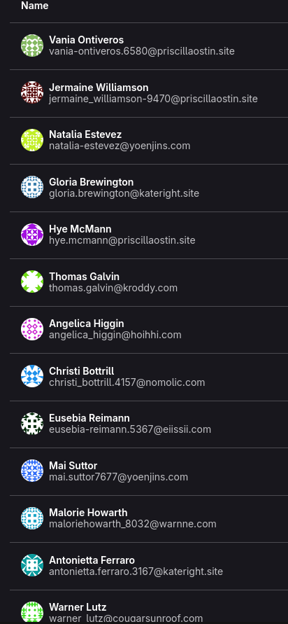

{ width=200 }

We've made some changes to prevent bot accounts from signing up.
<!-- more -->

## What do these bots do?

These bots are really simple. They use custom domains to mass generate emails and sign up under generic names. Once signed up, they fork any available repos. They clog up the user database and potentially even server storage space depending on the projects forked. We already have project limits and automatic deactivation of inactive accounts, but these are not enough.

{ width=300 }

!!! question "What about banning the patterns they use to name their emails using regex?"
    Some of said patterns are used by humans too (like `firstname.lastname@domain.com` or `firstname-lastname@domain.com`).

## Email Allowlist

This wasn't something I wanted to do (I already tried reCAPTCHAv2, the only captcha Gitlab supports), but I'd like to keep registration open.

This is the list of allowed email domains (**likely out of date by now, check the [sign-in page](https://git.blendos.co/users/sign_in){ target="_blank" rel="noopener noreferrer" } for the latest list**):

- `pm.me`
- `proton.me`
- `hey.com`
- `tutanota.com`
- `outlook.com`
- `gmail.com`
- `ubuntu.com`

We also allow certain custom domains used by verified users. If you'd like yours added (or a large public provider I missed), [contact us](../../team.md).

## 2FA Requirement

To keep the bots from doing anything after signing up (and to make people secure their accounts better), 2FA is now required. After signing up, you will be redirected to the 2FA page (and will be unable to go anywhere else until you set up 2FA). Existing users that sign in from now on will also have to do this.

!!! question "But I don't have a smartphone!"
    Modern password managers like [KeePassXC](https://keepassxc.org/docs/KeePassXC_UserGuide#_adding_totp_to_an_entry){ target="_blank" rel="noopener noreferrer" } or [Proton Pass](https://proton.me/support/pass-2fa){ target="_blank" rel="noopener noreferrer" } also support 2FA codes (called TOTP or "2FA secret").

## Next Steps

The next big thing is to remove over 5k bot accounts that are still here. Project limits added earlier on prevent them from forking repos (which they used to do), these measures are designed to stop new bots from signing up.
Verification systems in the middle like Anubis are a possibility, but these bots aren't the same as AI crawlers. If it's effective, this won't be needed anymore. However, these restrictions will remain for the time being.
