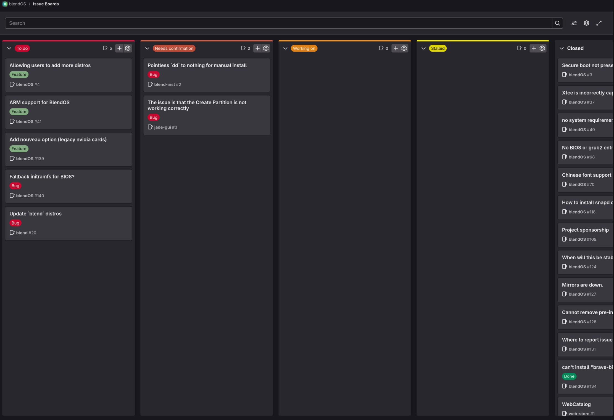

Yes, we finally have a simple and coherent way to keep track of progress on various issues related to this distro:

https://git.blendos.co/groups/blendOS/-/boards{ target="\_blank" rel='noopener noreferrer' }

(also under **Plan > Issue Boards** on the group page)

<!-- more -->

Here's what each section means:

- **To Do**{.red} \- Stuff we have to do (duh).
- **Needs Confirmation**{style="color:#be4d37;"} \- Something that needs to be verified by a contributor or anybody else.
- **Working on**{.orange} \- Something we've made marginal progress on.
- **Stalled**{.yellow} \- Cannot be fully completed for various reasons (each issue will have its own tag saying why)
- **Closed** \- Completed issues (Boards do not show closed issues so this can't be a tag).

So, if you have any specific issues, please bring them to the Gitlab ([sign up](https://git.blendos.co/users/sign_up){ target="_blank" rel="noopener noreferrer"} to do so).

Gitlab issues do require a degree of specificity before they can be classified on the board. An issue titled "black screen" needs to be worked out before we can figure out what the problem is and fix it. We also need confirmation that it's happening to more than a couple users.

The Discord support forum, subreddit and other chatrooms can still be used, and anything pertinent will be put on Gitlab by a contributor. We will slowly move existing issues from Discord onto Gitlab in the near future.

!!! note "Major codebase changes and features may be marked Stalled due to ongoing work on v5 behind the scenes."
