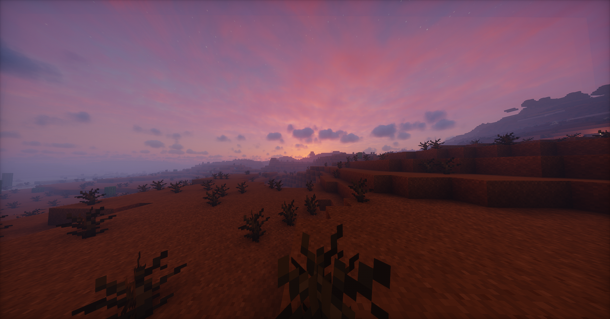

<small>Shot on the server with [Photon](https://modrinth.com/shader/photon-shader){ target="_blank" rel="noopener noreferrer" } and [Iris](https://www.irisshaders.dev/){ target="_blank" rel="noopener noreferrer" }.</small>

TL;DR: Vanilla 1.21.5 SMP now live at `smp.blendos.co` (`smp.blendos.co:33372` for Bedrock users), apply here: https://tally.so/r/wkrDed{ target="_blank" rel="noopener noreferrer" }
<!-- more -->

## What?

blendOS used to have a private SMP, but Rudra stopped maintaining it. I'm bringing it back on my server because I wanted to. There's also a new and improved registration form that won't require a Google account (or any account at all).

The only gameplay change is creeper explosions no longer create craters. The only client mod you'll want is **[Simple Voice Chat](https://modrinth.com/plugin/simple-voice-chat/){ target="_blank" rel="noopener noreferrer" }** to talk to other players.

The server also has ViaBackwards so you can connect from Minecraft clients running 1.9 or later.

P.S. I also recommend [Prism Launcher](https://prismlauncher.org){ target="_blank" rel="noopener noreferrer" }.

## Why?

Because I felt like it. This isn't a major thing, the old SMP was basically abandoned. I'm hosting this new one I'll actually keep updated. It's not much right now (I just want simple vanilla gameplay), and under whitelist to prevent griefing. I hope you have some fun with it. :smile:

You will have access to EssentialsX, so you can create homes and stuff (`/sethome <name>` and `/home <name>`, `/spawn` to tp to spawn). Bedrock support may or may not work, the connection was tested and works but I don't have a Windows machine so I can't test if it's playable.

There's also a Discord channel synced to game chat you can use (if you're on Matrix or Telegram it will be bridged for you). Images do work and will render in-game when their links are hovered over (must link to a FILE though, no tenor links).

## I want in!

[:fontawesome-solid-asterisk: Apply Now!](https://tally.so/r/wkrDed){ target="_blank" rel="noopener noreferrer" .md-button}

<small>Please don't make duplicate submissions.</small>
