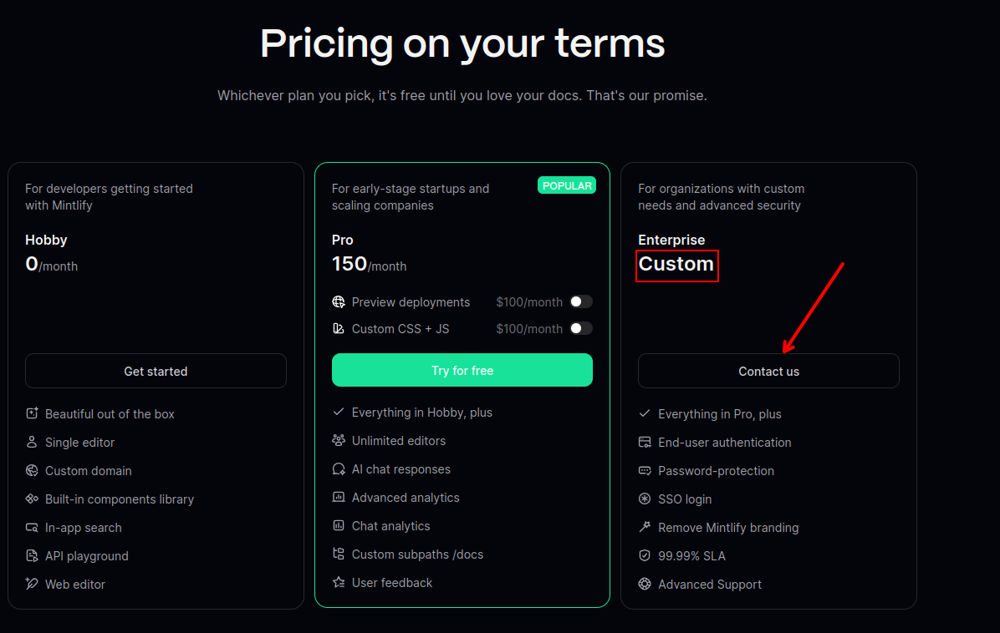
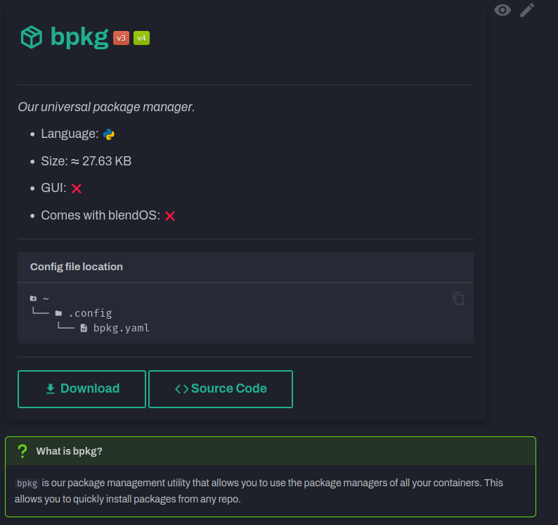

<style>
.built-with-footer {
  display: none;
}

.md-content__button {
  display: none;
}
</style>

{ .off-glb }

The website you are looking at right now is an amalgamation of time and effort over multiple iterations and docs frameworks. I intend to explore the history and timeline of this website, because it's actually rather interesting.
<!-- more -->

!!! info "Click on images to expand them."

## History

### Docs

Our documentation has changed quite a bit. Going through multiple iterations and frameworks, before arriving at what it looks like today.

<the-fold></the-fold>

#### [Docusaurus](https://docusaurus.io){ target="_blank" rel="noopener noreferrer" }

=== "Index"
    
=== "Content View"
    
=== "Guides"
    
    
    <small>From an [older snapshot](https://web.archive.org/web/20230813023101/https://docs.blendos.co/guides/){ target="_blank" rel="noopener noreferrer" }.</small>

[:simple-internetarchive: Archive link](https://web.archive.org/web/20240509150643/https://docs.blendos.co/){ target="_blank" rel="noopener noreferrer" .md-button }

When I first joined the team and finished the install guide, it had a rather bad layout, using Docusaurus's blog feature to hold guides. I completed the setup guide and wrote a basic guide for the blendOS settings app, which is now System Settings.

Docusaurus has extremely slow build times and is quite limited in terms of appearance and components (unless you know CSS and React).

I also wrote the guide like an idiot, using "appendices" at the end to hold certain information.


I also forgot you could set custom admonition titles in Docusaurus, and made a garbage download page with too many admonitions that actually got used as the official download page :grimacing:.

{ width=300 }

The container guide was quite good, I must admit, but I felt limited by the components of Docusaurus (don't know any React :pensive:)

The team eventually decided to leave Docusaurus and try something else. Rudra said he wanted something that looked like the Hugo theme [Lotus Docs](https://lotusdocs.dev){ target="_blank" rel="noopener noreferrer" }, so that's what we started testing.

#### [Lotus Docs](https://lotusdocs.dev){ target="_blank" rel="noopener noreferrer" }

***images missing***

There are no images of the prototype, as I deleted it from my computer. Here's the demo site:

=== "Index"
    
    <small>There's way more to this index page but it's not important.</small>
=== "Content View"
    

However, it came with a whole host of issues. The color refused to change (was fixed later on), the feature set was quite small, and the docs for the theme were unfinished. The main blue button on the landing page always points to `/`, *always*. The dev is aware of the issue but it's still there as of writing this.

We quickly moved on to something that seemed far more promising.

#### [Starlight](https://starlight.astro.build){ target="_blank" rel="noopener noreferrer" }

=== "Index (Hero)"
    
=== "Index (Contd.)"
    
=== "Content View"
    

[:octicons-link-16: Link](https://blend-docs-starlight.pages.dev){ target="_blank" rel="noopener noreferrer" .md-button }

Starlight was *so cool*! It had plugins, cool components, and we had worked with Astro before on the landing page, so surely this would be a breeze!

I *did* however, find the builtin cards and icon set very limiting. [`astro-icon`](https://astroicon.dev){ target="_blank" rel="noopener noreferrer" } offered a solution, but alas, it did not work in cards.

Icons also seemed to be completely bonkers, and did not work inline with text at all (they'd be huge). I also noticed odd gaps between headings (larger than normal) when switching to MDX (being forced into JSX syntax for HTML was not fun either).

The configuration also had too many brackets and braces for my liking and was quite a bother sometimes.

My favorite parts were the `FileTree` and `Steps` components, shown below:

=== "`FileTree`"
    
=== "`Steps`"
    

Alas, the aforementioned issues meant I dropped Starlight as well. :frowning2:

#### Honourable Mentions

##### [Mintlify](https://mintlify.com){ target="_blank" rel="noopener noreferrer" }


<small>Taken from the [Mintlify Starter Kit](https://starter.mintlify.com/introduction){ target="_blank" rel="noopener noreferrer" }.</small>

Mintlify looks great. It *is* a SaaS like Gitbook, but anything is better than Gitbook. It seems to be very similar to [Guider](https://neatojs.com/docs/guider){ target="_blank" rel="noopener noreferrer" } by NeatoJS, but closed-source and with more builtin components. I thought about using it, however its Gitlab integration is paid:



<small>Taken from Mintlify's [pricing page](https://mintlify.com/pricing){ target="_blank" rel="noopener noreferrer" }. Prices are in USD.</small>

It also really only works if your website looks like this:


<small>Taken from [Resend](https://resend.com){ target="_blank" rel="noopener noreferrer" }.</small>

And its components aren't as flexible (custom CSS/JS is also paid).

### Site

#### [Astro](https://astro.build){ target="_blank" rel="noopener noreferrer" }

=== "Index"
    
=== "Blog"
    

[:simple-internetarchive: Archive Link](https://web.archive.org/web/20230730184951/https://blendos.co/){ target="_blank" rel="noopener noreferrer" .md-button }

The original site was made from a free Astro theme called [AstroWind](https://astro.build/themes/details/astrowind/){ target="_blank" rel="noopener noreferrer" } and was quite nice. It had plenty of components and a built-in blog. We rolled with this for ages until we changed to a new theme:


[:simple-internetarchive: Archive link](https://web.archive.org/web/20240302172340/https://blendos.co/){ target="_blank" rel="noopener noreferrer" .md-button }

I didn't like this one, it had no features and looked terrible. While this site was up I was slowly developing our Material for MkDocs site to go under `docs.blendos.co` (more on that later).

### Blog

#### [Astro](https://astro.build){ target="_blank" rel="noopener noreferrer" }

=== "Index"
    
=== "Post"
    
[:simple-internetarchive: Archive link](https://web.archive.org/web/20230608023320/https://blendos.co/blog/){ target='_blank" rel="noopener noreferrer" .md-button }

The aforementioned Astro theme had a very basic blog that still looked nice and had RSS support. It only offered basic Markdown features (+ HTML). I liked it a lot, shame it had to go... :disappointed:

When changing the Astro theme, Rudra moved the blog somewhere else, shown below.

#### [Hashnode](https://hashnode.com){ target="_blank" rel="noopener noreferrer" }

=== "Index"
    
=== "Post"
    
=== "Email Newsletter"
    
[:octicons-link-16: Link](https://blog.blendos.co){ target="_blank" rel="noopener noreferrer" .md-button }

<small>This link *should* be a redirect but isn't because Rudra forgot about it.</small>

This is Hashnode. You get a block-based WYSIWYG editor with Markdown support and some basic extras (no buttons or anything this isn't Substack). You also get a cookie-cutter blog site with an annoying newsletter reminder enabled by default. You also get an email newsletter (yipppeeeeeeee :unamused:). I actually used to use this for my own personal blog before moving to Hugo.

However, we decided it would be easier to move the blog to Material for MkDocs once the site began taking shape, it's better not to use a managed service and we retain more control this way.

## The Present

Eventually, I went back to [Material for MkDocs](https://squidfunk.github.io/mkdocs-material){ target="_blank" rel="noopener noreferrer" }. I had made a really basic prototype that looked terrible. At this point I had more experience with the theme, using it to work on the [AtlasOS Docs](https://docs.atlasos.net){ target="_blank" rel="noopener noreferrer" }. With this, I built a basic docs index page, and began writing different pages and things, including a bad "system customization" guide.

I created a repository under my personal account (@blendgit:asterisk/blend-docs-material{ target="_blank" rel="noopener noreferrer" }) and got to work.

I wanted this site to look different, and the first place I began was when I saw a different style for the theme, which I will call "Material for MkDocs Neon." These CSS styles was used on places like the [Python Markdown Extensions docs](https://facelessuser.github.io/pymdown-extensions/){ target="_blank" rel="noopener noreferrer" } and made by @facelessuser{ target="_blank" rel="noopener noreferrer" }.

After unceremoniously copying the needed CSS, changing some colors, and making the footer smaller, the baseline appearance was good to go. I decided for an uncommon strategy among Material for MkDocs sites, and put icons in the [top navigation menu](#). The way you do this is to make sure every page is in its own folder and called `README.md` with a set icon. When linked into the navigation's top bar, the icon will show. Rather cumbersome, but worth it in my opinion.

I decided I wanted to use every part of this theme, so I set up the offline build system. Using `sed` to inject commit IDs into the announcement banner during our CI/CD pipeline, it allows for offline builds to be properly versioned outside of the Gitlab web UI.


<small>The reason that screenshot is in dark mode is because that's the *intended* mode. The mode is chosen based on your OS theme, but the fallback theme is dark mode, because I think it looks better.</small>

As I was writing, I found points where I decided to extend the theme to get what I wanted. For example, I hooked up my [Umami](https://umami.is){ target="_blank" rel="noopener noreferrer" } instance to gather privacy-friendly anonymous analytics. I made additional admonition types to suit my needs, then copied a follow system for them (where the top of the admonition follows you down the page) off a [Github discussion](https://github.com/squidfunk/mkdocs-material/issues/7073#issuecomment-2068332841){ target="_blank" rel="noopener noreferrer" }  in case they were too long. I also added [`mkdocs-macros`](https://mkdocs-macros-plugin.readthedocs.io/en/stable/){ target="_blank" rel="noopener noreferrer" } and have cooked up several basic macros so I can manage what all links of a certain type look like easily.

Another thing I did that I've never seen before is making all codeblocks on the site use a [Nerd Font](https://nerdfonts.com){ target="_blank" rel="noopener noreferrer" }, specifically `FiraMono`. This allowed me to use Nerd Font icons in codeblocks, which are way better than emoji, especially for file trees.

I was also inspired by the [Couleur Tweak Tips software cards](https://ctt.cx/video/cutters/avidemux/#avidemux){ target="_blank" rel="noopener noreferrer" } (same place I found the sidebar tweaks), and made every reference *page* have a reference *card* to explain basic information.

{ width=400 }

<small>Couleur Tweak Tips card</small>

{ width=400 }

<small>`bpkg` reference card</small>

The site initially used the [`privacy` plugin](https://squidfunk.github.io/mkdocs-material/plugins/privacy/){ target="_blank" rel="noopener noreferrer" } but that fell through once I wanted to use badges from our [status page](https://status.asterisk.lol/status/blendos){ target="_blank" rel="noopener" }. Turns out there's [a website](https://gwfh.mranftl.com/fonts){ target="_blank" rel="noopener noreferrer" } that lets you download Google Fonts files in `woff2` format easily (+ CSS snippets for them), negating the main concern and need for the plugin. We basically just download what we can now.

*[admonition]: Blocks with a color and icon to point something out with emphasis.

Now, since the docs looked so cool and modern to Rudra, he decided to ditch Astro ans make the docs the website. My repo was forked (the website repo still is a fork) into a proper website (really just adding the "intro" and changing the index page), and the swap eventually took place.

[The blog](../index.md) and [RSS support](/feed_rss_created.xml) came after that, we ported over all the old posts and it looks quite nice, you get all the same Markdown features. We even made an empty Github repo for [Giscus comments](https://giscus.app){ target="_blank" rel="noopener noreferrer" } (comments powered by Github Discussions). Quick fun fact, that RSS icon on the main page isn't actually part of the [`blog` plugin](https://squidfunk.github.io/mkdocs-material/plugins/blog/){ target="_blank" rel="noopener noreferrer" } (wish it was), I had to add that manually. You can see a small gap between it and the post list, but it's so small it's hard to see.


The reason everything I talked about is possible is because of how powerful Material for MkDocs is. It's an easy way to build a nice website in pure Markdown and YAML (or HTML too if you want, via partials), with loads of plugins for additional functionality (and integration with some community plugins like [`mkdocs-rss`](https://guts.github.io/mkdocs-rss-plugin/){ target="_blank" rel="noopener noreferrer" } too) By default, you're able to create basically whatever you want. Cards, for example, are *pure markdown*, so they can look like anything. It comes with a bunch of classes to make basic tasks easier, like grids and buttons.

```md title="Simple Cards!"
<div class="grid cards" markdown>
- :material-cards-playing-club: card 1
- :material-cards-playing-diamond: card 2
</div>
```
<div class="result" markdown>
<div class="grid cards" markdown>
- :material-cards-playing-club: card 1
- :material-cards-playing-diamond: card 2
</div>
</div>

```md title="Complex Cards!"
<div class="grid cards" markdown>

-   :material-clock-fast:{ .lg .middle } __Set up in 5 minutes__

    ---

    Install [`mkdocs-material`](#) with [`pip`](#) and get up
    and running in minutes

    [:octicons-arrow-right-24: Getting started](#)

-   :fontawesome-brands-markdown:{ .lg .middle } __It's just Markdown__

    ---

    Focus on your content and generate a responsive and searchable static site

    [:octicons-arrow-right-24: Reference](#)

-   :material-format-font:{ .lg .middle } __Made to measure__

    ---

    Change the colors, fonts, language, icons, logo and more with a few lines

    [:octicons-arrow-right-24: Customization](#)

-   :material-scale-balance:{ .lg .middle } __Open Source, MIT__

    ---

    Material for MkDocs is licensed under MIT and available on [GitHub]

    [:octicons-arrow-right-24: License](#)

</div>
```
<div class="result" markdown>
<div class="grid cards" markdown>

-   :material-clock-fast:{ .lg .middle } __Set up in 5 minutes__

    ---

    Install [`mkdocs-material`](#) with [`pip`](#) and get up
    and running in minutes

    [:octicons-arrow-right-24: Getting started](#)

-   :fontawesome-brands-markdown:{ .lg .middle } __It's just Markdown__

    ---

    Focus on your content and generate a responsive and searchable static site

    [:octicons-arrow-right-24: Reference](#)

-   :material-format-font:{ .lg .middle } __Made to measure__

    ---

    Change the colors, fonts, language, icons, logo and more with a few lines

    [:octicons-arrow-right-24: Customization](#)

-   :material-scale-balance:{ .lg .middle } __Open Source, MIT__

    ---

    Material for MkDocs is licensed under MIT and available on [GitHub]

    [:octicons-arrow-right-24: License](#)

</div>
</div>

```md title="Buttons!"
[Normal link](#){ .md-button }
```
<div class="result" markdown>
[Normal link](#){ .md-button }
</div>

My point with this is that every custom element is not complicated JSX or HTML, just plain Markdown, and somehow, that can offer a lot of customizability, and of course, you can bundle whatever custom CSS and JS you want easily.

I wanted this site to make a splash, it's a new distro and the site should be something different, not a terrible WordPress site that hurts your visitors' eyes (https://nobaraproject.org{ target="_blank" rel="noopener noreferrer" }, for now anyway), or a website that was made decades ago and hasn't been updated since (https://debian.org{ target="_blank" rel="noopener noreferrer" }). I want to show people something they haven't seen before, and if I can't make a custom Astro or NextJS site I'll go for the next best thing, this theme.

It's simple and versatile, yet good-looking, even more so once I found out about @facelessuser{ target="_blank" rel="noopener noreferrer" }'s "Neon" CSS I mentioned earlier. The pricing model *does* mean the community edition rarely gets feature updates, incentivising more people to buy [Insiders](https://squidfunk.github.io/mkdocs-material/insiders/){ target="_blank" rel="noopener noreferrer" } (the paid version of the theme with extra features, those features hit the free version once certain funding goals are met).

This site probably will change, we all do. All I can hope is that it just keeps getting better.

## The Future

I suppose I might as well say something more while I'm at it. I've been considering opening a section of these docs to let anybody with some kind of writing skills and a fluent knowledge of English write guides.

Oh, and we'd *only* be accepting guides in English, see the abstract below.

The below question has been asked a few times, by people who either want a specific language or who genuinely want to help (thanks :smiling_face_with_3_hearts:). For those looking to help translate the docs, I'm sorry. Due to the reasons shown in the abstract below, it's just not feasible. Instead you can put your translation efforts towards **System Settings** (something that *should* be in other languages too), Linux as a whole, or your favorite Linux desktop.

??? question follow "Why won't you embrace `i18n` for your docs?"
    Firstly, Google Translate's web translator works very well and updates automatically, as humans are naturally slower and must manually update translations. This works in any case where you *need* a translation.
    
    Also, English is like Latin for tech docs, the main language everything is written in. [`system.yaml`](../../reference/configs/system.md) is written using English words! There are also a lot of different languages and dialects of those languages spoken around the world, it's an insurmountable wall for all but the largest of corporations or communities.

    I write everything in English. Can the proper meaning and sense be copied over into other languages? These translators *aren't me*. Can they copy my written voice properly into another language? I also can't double-check their work for any language I don't understand. There's a lot of risk here. A lot of my thoughts on this come from when Atlas (**NOT** the Rust server) was considering `i18n` for their docs, but ultimately dropped it in favour of Google Translate for similar reasons.

    The rest of your system will also be available in almost every language (see [our guide on adding them](../../faq.md#the-language-i-want-isnt-there)) as well.

    **If you disagree or find holes in this argument, feel free to comment at the bottom.**
    
    `i18n` can also introduce other issues, as demonstrated in this quote from [Valetudo](https://valetudo.cloud){ target="_blank" rel="noopener noreferrer" }, an alternate smart vacuum OS:

    ??? quote "TL;DR"
        `i18n` can waste time and introduce additional complications and loss of meaning, and isn't actually necessary because people can manage English interfaces even if they barely speak it.

        The difficulties resulting from this take a lot of time to fix, and require very talented translators who also have the required technical knowledge.

    > **Valetudo is only available in english**
    >
    > Valetudo does not feature any localization. Let me explain the reasoning behind this with a few examples.
    >
    > First, consider this car radio in a car made for the german market:
    >
    > { width=350 }
    >
    > In fact, the radio is engineered by Bosch in Hildesheim. Still, the button isn’t labeled `Karte`.
    >
    > Now, let’s take a look at the Valetudo UI (Version 0.6.1).
    >
    > [...]
    >
    > Considering that people do in fact manage to use their car radios even if their english skills may be lacking, I’d say that accessibility isn’t a problem here.
    >
    > As a matter of fact, Internationalization isn’t free. It always introduces more work, more complexity etc.
    > Of course accessibility is often worth the effort, however since we’ve already established that this factor isn’t relevant here, we can take a look at a non-exhaustive list of downsides of `i18n`:
    > 
    > - Getting support is harder when screenshots/error messages are in a language that isn’t english, because supporters may not speak it
    > - Development of new features, refactoring etc. is always blocked by having to translate everything new to all languages
    > - Increased codebase complexity
    >     - Harder to read
    >     - Harder to work with
    > - Lots of initial work to translate everything
    >     - Time/effort that could be spent better elsewhere
    >
    > Now, let us look at another real-world example of i18n:
    >
    > { width=300 }
    >
    > This is a screenshot of Apple Shortcuts running on an iPhone set to the German locale. It is just a basic HTTP PUT with a JSON payload. For some reason however: 
    > 
    > - `Header` as in "HTTP Header" was translated to `Überschrift` which means “Headline”
    > 
    > - `Request body` became `Haupttext anfordern` which translated back to english means “(to) request the main text”
    >
    > 
    >
    > This is another example. Here we have the Integrated Development Environment Visual Studio 2017 made by Microsoft attempting to open a project file that was created in an older version of Visual Studio.
    >
    > Instead of asking us if we want to change the target SDK of the project file \- which is called `solution` in Visual Studio \- it is showing us a dialog titled `Lösungsaktionen prüfen` which translates back to “check actions to solve something”. Then there’s a sub-header labelled `Projekte neu ausrichten` which translates to “realign projects” (plural).
    >
    > The only way I was able to decipher what that dialog even means was by opening the same project on a different system with the locale being set to `en-US`.
    >
    > In both examples, the actual meaning got lost in translation, which is a common issue. Even with german being a common language and understanding of the HTTP protocol being fairly common as well.
    >
    > Preventing this is hard, because you will need someone who understands the project from a technical standpoint as well as speaks the language it should be translated to. This is also required even if the translation is done by someone else, because you still have to validate what they did.
    >
    > As even huge corporations known for being user-friendly and also paired with insane budgets fail to do this all the time, I don’t think that it is actually a feasible task.
    
    *\- Valetudo [[Source](https://valetudo.cloud/pages/general/why-not-valetudo.html){ target="_blank" rel="noopener noreferrer" }] with minor formatting changes*
However, we still have to work out Gitlab's terrible permission system. We can't exactly allow specific users to make repos, apparently that's not possible, the permission management isn't *that* granular. Once we work out how to fix that we can start opening up such a framework (initially was going to be a MediaWiki wiki but this theme has the power of a wiki engine anyway thanks to the [`macros` plugin](https://mkdocs-macros-plugin.readthedocs.io/en/stable/){ target="_blank" rel="noopener noreferrer" }).

I will also look to restructuring the [install guide](../../install/normal-pc.md) and make it a bit more... *readable*. A T2 Linux install guide will be coming once our T2 Linux contributor is available to write one, I have no knowledge on that subject.

If you have any thoughts on this, leave a comment.

Thanks for reading.

*- [Asterisk](https://asterisk.lol){ target="_blank" rel="noopener" }*