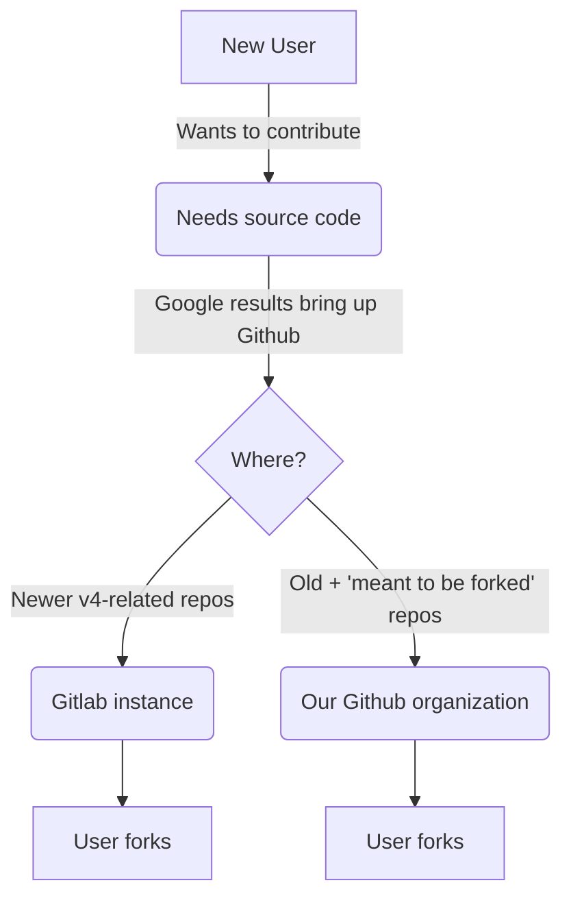

# :material-handshake: Contributing

Read the [**Git structure page**](#git-structure), then go see an area of contribution below:

[:material-mirror: Mirroring](#mirroring){ .md-button } [:material-newspaper-variant: Docs](#docs){ .md-button }

## :material-git: Git Structure

Our repositories are split across multiple places, this is the average contribution path:



Most users will never find the Gitlab and will see old decrepit repos alongside newer ones on our [:material-github: Github organization](https://github.com/blend-os){ target='_blank" rel="noopener noreferrer" }. Please remember all new repos are on our [:fontawesome-brands-gitlab: Gitlab instance](https://git.blendos.co/blendos){ target="_blank" rel="noopener noreferrer" }, except for "meant to be forked" repos.

You should already know how to use both services depending on what you're contributing to. For things like the tracks repo, view the [Github start guide](https://docs.github.com/get-started/quickstart){ target="_blank" rel="noopener noreferrer" }. For all v4-related repos on our Gitlab, see [Gitlab's start guide](https://docs.gitlab.com/ee/user/index.html){ target="_blank" rel="noopener noreferrer" }.

*[meant to be forked]: Repositories meant to be forked and edited by users easily to suit their needs, like our tracks repo

## :material-mirror: Mirroring

If you'd like to mirror our package repo and/or ISOs, here's the basics for it.

### :material-chart-bar: Current (ish) stats

- :material-folder-zip: Size: :material-approximately-equal:3 GB (repo and current testing ISO)
- :material-file-multiple: Number of files: 36
- :material-server: Mirrors: 7 (excluding cloud storage services)
- :material-earth-box: Coverage: NA, EU, AU/NZ, KP
- :material-refresh: Rsync: :octicons-x-12:{ .red } (available from other mirrors)

A mirror list is available on the [download](download/README.md) page.

### :material-clipboard-list: Procedure

If you'd like to mirror, great! Here's the steps:

1. Note down your mirror's bandwidth (in Gbps), country, name, and what you'll be serving (ISO-only, repo-only or both)
2. Clone the master package repo mirror via `wget` and grab the latest ISO:
    
    ??? abstract "ISO mirroring"
        You can use the following script:

        ```bash
        #!/bin/bash
        ISO_URL="https://git.blendos.co/api/v4/projects/32/jobs/artifacts/main/raw/blendOS.iso?job=build-job"
        LOCAL_ISO_PATH="/var/www/mirrors/blend/isos/testing/blendOS.iso"
        ISO_VERSION_URL="https://git.blendos.co/api/v4/projects/32/jobs/artifacts/main/raw/version?job=build-job"
        LOCAL_VERSION_FILE="/var/www/mirrors/blend/isos/testing/version"
        
        download_iso() {
            rm -rf $LOCAL_ISO_PATH
            wget -O "$LOCAL_ISO_PATH" "$ISO_URL"
            wget -O "$LOCAL_VERSION_FILE" "$ISO_VERSION_URL"
        }
        
        get_remote_version() {
            wget -O - "$ISO_VERSION_URL"
        }
        
        REMOTE_VERSION=$(get_remote_version)
        LOCAL_VERSION=$(cat "$LOCAL_VERSION_FILE")
        
        if [ "$REMOTE_VERSION" != "$LOCAL_VERSION" ]; then
            echo "New ISO version detected. Downloading..."
            download_iso
            echo "$REMOTE_VERSION" > "$LOCAL_VERSION_FILE"
        else
            echo "ISO is up-to-date."
        fi
        ```
        
        <small>Replace `LOCAL_ISO_PATH` and `LOCAL_VERSION_FILE` with the path to your webserver followed by `blendOS.iso` and `version` respectively. Keep the file names as-is.</small>
        
        Set this up to a `systemd` timer unit or cronjob, and it will keep everything up-to-date.

    ??? abstract "`wget` mirroring for the package repo"
        Otus has provided a cronjob for this:
    
        ```
        0 * * * * wget --mirror --no-parent --no-host-directories -P $WEB_FOLDER https://pkg-repo.blendos.co/ && find $WEB_FOLDER -type f -name 'index.html*' -delete
        ```
    
        Where `$WEB_FOLDER` is your web data folder.
    
        This tells wget to download everything without any parent or domain folders, then we use `find` to remove all the `index.html` files.
    
        I wish we had `rsync` too, but here we are. :expressionless:

1. If mirroring the ISO, add a CORS header to allow us to fetch your `version` file:
   
     <small>Examples taken from the [MDN web docs](https://developer.mozilla.org/en-US/docs/Web/HTTP/CORS/Errors/CORSMissingAllowOrigin){ target="_blank" rel="noopener noreferrer" }.</small>
     ```http
     Access-Control-Allow-Origin: https://blendos.co
     ```

     ```apache title="Apache"
     Header set Access-Control-Allow-Origin 'https://blendos.co'
     ```

     ```nginx title="Nginx"
     add_header 'Access-Control-Allow-Origin' 'https://blendos.co' always;
     ```

    !!! info "The `caddy.cors` plugin is not available for Caddy v2."

     ```title="Caddy (v2)"
     header Access-Control-Allow-Origin "https://blendos.co"
     ```

1. Contact Asterisk via one of our chatrooms (in the footer of this page) to get your mirror listed


### :material-note: Notes

You will be asked if you'd like to be used as a webseed for the [FOSS Torrents torrent](https://fosstorrents.com/distributions/blendos/){ target="_blank" rel="noopener" }. This is totally up to you.

You will be added to our [status page](https://status.asterisk.lol/status/blendos){ target="_blank" rel="noopener" } and pinged every 60 seconds. Please give us details if we need to ping something specific or if you want notifications.

If you have any questions, just contact us.


*[NA]: North America
*[EU]: European Union
*[AU/NZ]: Australia & New Zealand
*[KP]: Korean Peninsula (South Korea)

## :material-newspaper-variant: Docs
<small>[:material-git: Gitlab](https://git.blendos.co/blendos/website){ target="_blank" rel="noopener noreferrer" } \- [:material-license: CC BY-SA 4.0](https://git.blendos.co/blendos/website/-/blob/main/LICENSE){ target='_blank" rel="noopener noreferrer" } \- [:simple-materialformkdocs: Material for MkDocs](https://squidfunk.github.io/mkdocs-material){ target="_blank" rel="noopener noreferrer" }</small>

### :material-script-text: Rules

If you would like to add to our docs (please do), you should follow these simple rules.

1. **Keep it local.** If you use any external assets, *download them*. Only do not download something if it is dynamic (like a status badge) or there is no other way (like emoji). Static badges, script links pointing to fixed versions, fonts, images, files, download them all. Save them in the right category in the `docs/assets` folder. This is to minimize external requests.
2. **Link code properly.** Any code snippets you add should be snippet links to the original file if applicable. You can pull specific lines or even create sections to do this. Only do not do this if it would be way too cumbersome.
3. **External links should open in a new tab with no referrer.** (unless you have a specific reason not to) Make links like this:
    ```md
    https://google.com{ target="_blank" relk="noopener noreferrer" }
    [link text](https://google.com){ target="_blank" rel="noopener noreferrer" }
    ```
4. **Use frontmatter.** Set an `icon` and `description` for every page (examples can be seen in the source of any page). Include all pages in the [`#!yaml nav:` component](https://www.mkdocs.org/user-guide/configuration/#nav){ target="_blank" rel="noopener noreferrer" } of `mkdocs.yml` unless there is a reason not to.
5. **Be descriptive.** When writing config and CLI references especially, try to *show, not tell*. A full description of this approach can be seen in the Diátaxis framework: https://diataxis.fr/reference-explanation/{ target="_blank" rel="noopener noreferrer" }
6. **Follow the format.** We have established formats for directory pages and references. Follow them. Headers have icons. References begin with a reference card. Config references need to use code annotations. CLI references should be easy-to-read lists (showing the code like in the `bpkg` reference is optional). Directory pages should use cards to show what users can click on.
7. **Keep it navigateable.** Mobile users should not have to open the hamburger menu to get anywhere on the site from the root (they can still use it to go back or to skip directory pages).
8. **Be semi-casual.** For guides, you may find it better to be less distant from the reader. However, you need to also offer a reliable explanation of steps. You can decide what that looks like. References however, should always be distant (rule 5).
9. **Use the features given to you.** Be expressive! You are writing with one of the most powerful documentation frameworks out there, so *use it!* Don't be afraid to try something new in your writing, style or layout.
10. **Always have a Javascript-free option.** You can use the [`noJs`](#javascript) system to pull this off.
11. **Always give your headers icons.** This helps them look nice, and will be even nicer once the `typeset` plugin hits the community edition.
12. **Header titles must match page titles.** Each page will have one level 1 header. Make your header like this: `#!md # :<icon-you-used>: <nav-title>`
13. **Merge to [`dev`](https://git.blendos.co/blendOS/website/-/tree/dev){ target="_blank" rel="noopener noreferrer" }.** This way you can preview everything before pushing it out.

*[directory pages]: Pages that show a list of possible paths in a folder, i.e. /install
*[Directory pages]: Pages that show a list of possible paths in a folder, i.e. /install
*[hamburger menu]: Those 3 lines mobile users see in the upper left.

### :octicons-code-16: Local Development

Local development is quite easy. You'll only need:

- :material-language-python: Python ≥ 3.9
- :material-package-variant: `pip` package manager (included with Python on Windows)

??? abstract "Using `pipenv` if `pip` cannot be used directly"
    Install pipenv [from pypi](https://pipenv.pypa.io/en/latest/installation.html){ target="_blank" rel="noopener noreferrer" } or your package manager.

    Then do the following in the project folder:

    ```
    pipenv install
    ```

    Then, as `pipenv` says, you can use `pipenv shell` and `pipenv run`:

    ```
    pipenv run mkdocs serve
    ```


Simply cd in and run (this command only has to be run once):

```bash
pip install -r requirements.txt
```

From there, start the dev server:

```bash
mkdocs serve
```

The server will reload after every save.

If you want to build the website into static HTML, run this command (this isn't required for contribution, the CI/CD server does it automatically):

```bash
mkdocs build
```

### :material-pencil-box: Writing

To learn how to write with Material for MkDocs, consult their [reference](https://squidfunk.github.io/mkdocs-material/reference/){ target="_blank" rel="noopener noreferrer" } and [extension list](https://squidfunk.github.io/mkdocs-material/setup/extensions/){ target="_blank" rel="noopener noreferrer" } to see its special components.

!!! question "Looking for examples?"
    Just click the :material-eye: on any page to view its source code!

!!! note ""
    Images and internal links are created **relative** to the file you're currently editing. Links should link to the markdown file itself, not a path. (e.x. `reference/README.md` `../assets/img/file.png`)

An overview of a few cool features you can use (**:material-star-box: denotes a custom feature**):

#### **:material-exclamation-thick: Admonitions** ([`admonition`](https://python-markdown.github.io/extensions/admonition/){ target="_blank" rel="noopener noreferrer"})
```html
!!! <type> "<title>"
    text

??? warning "collapsable"
    text

!!! note inline end <!-- or inline --> "Inline"
    text

??? abstract follow "󰩳 This one's header will follow you down the page!"
    looooong text
    
    

    a

    a

    a
    
    a
    
    a

    a

    a

    a


```

<div class="result" markdown>

??? warning "collapsable"
    text

!!! note inline end "Inline"
    text

??? abstract follow ":material-star-box: This one's header will follow you down the page!"
    looooong text


    a

    a

    a

    a

    a

    a

    a


</div>

In addition to the [regular admonition types](https://squidfunk.github.io/mkdocs-material/reference/admonitions/#supported-types){ target="_blank" rel="noopener noreferrer" }, we have also added a `code` admonition for making collapsable codeblocks:

```md
??? code "󰩳 file_name.ext"     <-- 󰩳 This has follow on by default
    ```
    code here, no space between admonition and code
    ```
```
<div class="result" markdown>

??? code ":material-star-box: file_name.ext"
    ```
    code here
    ```

</div>

As well as a `collapse` admonition:

```md
??? collapse "󰩳 X lines collapsed"    <-- 󰩳 This also has follow on by default
    1

    2
    
    3
```

<div class="result" markdown>

??? collapse ":material-star-box: X lines collapsed"
    1

    2

    3
</div>

And `video`:

```html
??? video "󰩳 Video Guide"
    <center>
    <video src="/assets/vid/example.webm" controls></video>
    <p>You should set a width and height if the video is too big, 
    and muted if it has no sound. 
    This p section can be omitted if no caption is required.<p>
    </center>

```

<div class="result" markdown>

??? video ":material-star-box: Video Guide"
    <center>
    <video src="/assets/vid/example.webm" controls></video>
    <p>You should set a width and height if the video is too big, and muted if it has no sound.
    This p section can be omitted if no caption is required.<p>
    </center>

</div>

#### **:material-emoticon: Emojis/Icons** ([`emoji`](https://facelessuser.github.io/pymdown-extensions/extensions/emoji/){ target="_blank" rel="noopener noreferrer" })

Call them via their shortcode:

```
:lobster:
```
<div class="result" markdown>

:lobster:

</div>

Call icons the same way:

```
:material-home:
```
<div class="result" markdown>

:material-home:

</div>

One thing that is a bit different on these docs vs. other sites is you can use icons :material-star-box: *in codeblocks*. Our codeblocks use a *Nerd Font*, which allows you to use icons within your code.

```
󰩳 I'm an icon!
```

Visit the cheatsheet: https://www.nerdfonts.com/cheat-sheet{ target="_blank" rel="noopener noreferrer" }

Find the icon you want and hover over it. In the copy section, hit `Icon`. Your editor will probably not be able to render the icon as it is not using a Nerd Font. Rest assured, it will render in your preview.

#### **:material-language-css3: CSS in Markdown** ([`attr_list`](https://python-markdown.github.io/extensions/attr_list/){ target="_blank" rel="noopener noreferrer" } & [`pm_attr_list`](https://github.com/paulmelis/pm_attr_list){ target="_blank" rel="noopener noreferrer" })
```md
[link](url){ option=value .class #id }
```
#### **:material-language-html5: Markdown in HTML** ([`md_in_html`](https://python-markdown.github.io/extensions/md_in_html/){ target="_blank" rel="noopener noreferrer" })
```html
<div markdown>
  **Markdown works** __just fine!__{ .someclass }
</div>
```
<div class="result" markdown>

  **Markdown works** __just fine!__


</div>

#### **:fontawesome-solid-scissors: Code Snippets** ([`snippets`](https://facelessuser.github.io/pymdown-extensions/extensions/snippets/){ target="_blank" rel="noopener noreferrer" })
!!! info "File paths are relative to the repo root."

```md
;--8<-- "link_or_file.ext"
```
```md
  ```
  ;--8<-- "link_or_file.ext"
  ```
```

We use this to make reusable Markdown snippets, and pull the latest version of a code file.

#### **:material-keyboard: Keybinds** ([`keys`](https://facelessuser.github.io/pymdown-extensions/extensions/keys/){ target="_blank" rel="noopener noreferrer" })

```md
++ctrl+alt+delete++
```
<div class="result" markdown>

++ctrl+alt+delete++
</div>

#### **:material-code-block-braces: Inline Syntax Highlighting ([`inlinehilite`](https://facelessuser.github.io/pymdown-extensions/extensions/inlinehilite/){ target="_blank" rel="noopener noreferrer" })**

```md
`#!lang code`

`#!python print("Hello World!")`
```
<div class="result" markdown>

`#!python print("Hello World!")`

</div>

#### **:octicons-link-16: Automatic Links** ([`magiclink`](https://facelessuser.github.io/pymdown-extensions/extensions/magiclink/){ target="_blank" rel="noopener noreferer" })

```md
https://google.com
```
<div class="result" markdown>
https://google.com
</div>

It also works for Github/Gitlab/Bitbucket links too!

**Legend:** `!` = PR `#` = Issue `?` = discussion `...` = Compare

```md
MagicLink supports shorthand references for GitHub, GitLab, and Bitbucket issues (#1), pull/merge requests (!100), GitHub Discussion 
(https://github.com/facelessuser/pymdown-extensions/discussions/1173), commits (23bb7083b4699703241d7552ff666cf8cef61337), and compares 
(23bb7083b4699703241d7552ff666cf8cef61337...0abca9679ec09ca289c345cc8843497fc0f8be9b). You can also reference repositories (https://
github.com/facelessuser/pymdown-extensions) and users (@facelessuser). Mentions also works for social media (only Twitter is supported 
at this time).
```
<div class="result" markdown>
> MagicLink supports shorthand references for GitHub, GitLab, and Bitbucket issues (#1), pull/merge requests (!100), GitHub Discussion (https://github.com/facelessuser/pymdown-extensions/discussions/1173), commits (23bb7083b4699703241d7552ff666cf8cef61337), and compares (23bb7083b4699703241d7552ff666cf8cef61337...0abca9679ec09ca289c345cc8843497fc0f8be9b). You can also reference repositories (https://github.com/facelessuser/pymdown-extensions) and users (@facelessuser). Mentions also works for social media (only Twitter is supported at this time).
</div>

If you do not specify a repo, the default repo will be used (here, it's https://github.com/blend-os/blendos (Github)).

:material-star-box: You can also specify links to our git server:

!!! note "Gitlab subgroups do not work."

```md
󰩳 @blendgit:asterisk
󰩳 @blendgit:blendos/docs
```
<div class="result" markdown>
@blendgit:asterisk

@blendgit:blendos/docs
</div>

!!! tip "There's a lot more!"
    See the full [reference](https://squidfunk.github.io/mkdocs-material/reference/){ target="_blank" rel="noopener noreferrer" } and [extension list](https://squidfunk.github.io/mkdocs-material/setup/extensions/){ target="_blank" rel="noopener noreferrer" } for more cool features.

### :material-script-text: Javascript

If you add custom HTML elements with Javascript, please use the `noJs` system to provide a Javascript-free option.

Add this section to the page:

```html
<script>
    var styleSheet = document.createElement("style")
    styleSheet.innerText = '.noJs { display: revert !important }'
    document.head.appendChild(styleSheet)
</script>
```

This script will show `noJs` elements (which are hidden by default) and will not run if Javascript is disabled.

Next, give **the trigger of the Javascript (i.e. a button)** *and/or* **the `#!html <div>`/`#!html <span>` where the Javascript inserts content** the `noJs` class.

Now, if you have a Javascript-free replacement (a warning saying you need Javascript or a replacement button), put it in a `#!html <noscript>` tag.

No external libraries should be used unless they are either *essential* (can't be done without JS and this library) or the rest of the docs could benefit from them. If either of these things are the case, rule 1 still applies, ***do not use a CDN***.

Example:

```html title="awesome-page.md"
<script>
    console.log("Hello!")
    document.getElementById('someDiv').innerHTML = "html goes here"
</script>

<span id="someDiv" class="noJs"></span>

[Button](javascript:history.forward){ .noJs .md-button }

<noscript>You need Javascript for this.</noscript>

**content**

<script>
    var styleSheet = document.createElement("style")
    styleSheet.innerText = '.noJs { display: revert !important }'
    document.head.appendChild(styleSheet)
</script>
```


### :material-cog: :material-star-box: Macros

We have set up [`mkdocs-macros`](https://mkdocs-macros-plugin.readthedocs.io/en/stable/){ target="_blank" rel="noopener noreferrer" } to turn MkDocs into more of a wiki engine.

We have created the following macros:

**Package links (v4 containers only)**



```md
{{ aur("aur-package") }}
```

<div class="result" markdown>

{{aur ("vesktop-bin") }}

</div>



```md
{{ archpkg("some-package") }}
```

<div class="result" markdown>

{{ archpkg("linux-zen") }}

</div>

```md
{{ ubpkg("some-ubuntu-thing") }}
```

<div class="result" markdown>

{{ ubpkg("software-properties-common") }}
</div>

```md
{{ debpkg("some-debian-thing") }}
```


<div class="result" markdown>

{{ debpkg("apt-transport-https") }}

</div>


```md
{{ fedorapkg("some-fedora-thing") }}
```

<div class="result" markdown>

{{ fedorapkg("dnf-utils") }}
</div>

**URL schemas**


```md
{{ track("track-from-our-repo-without-extension") }}
```

<div class="result" markdown>

{{ track("lxqt") }}
</div>


```md
{{ custom_track("your-impl-url", "your-track-name-without-extension") }}
```

<div class="result" markdown>

{{ custom_track("https://github.com/noahimesaka1873/blendos-tracks-t2/raw/main", "blendos-base-t2") }}

</div>

```md
{{ reference("folder", "page") }}
```

<div class="result" markdown>

{{ reference("utils", "bpkg") }}
</div>

**Container Registries**


```md
{{ dockerhub("author", "image") }}

* If the image has no author (r/_/container), set the author to library.
```

<div class="result" markdown>

{{ dockerhub("library", "archlinux") }}

</div>

```md
{{ ghcr("author", "image") }}
```

<div class="result" markdown>
{{ ghcr("diced", "zipline") }}
</div>


```md
{{ quay("author, "image") }}
```

<div class="result" markdown>
{{ quay("toolbx", "ubuntu-toolbox") }}
</div>

**Git Forges**


```md
{{ github("user", "repo") }}
```

<div class="result" markdown>
{{  github("blend-os", "blendos") }}
</div>


```md
{{ gitlab("user", "repo", "subgroup", "subgroup1") }}

* subgroup and subgroup1 are optional arguments.
* Used as: gitlab.com/user/subgroup/subgroup1/repo
* They both default to nothing.
```

<div class="result" markdown>
{{ gitlab("gitlab-org", "gitlab") }}
</div>


```md
{{ codeberg("user", "repo") }}
```

<div class="result" markdown>
{{ codeberg("forgejo", "forgejo") }}
</div>


```md
{{ blendgit("user", "repo", "subgroup", "subgroup1") }}

* subgroup and subgroup1 are optional arguments.
* Used as: git.blendos.co/user/subgroup/subgroup1/repo
* They both default to nothing.
```

<div class="result" markdown>
{{ blendgit("blendos", "website") }}
</div>


```md
{{ sourcehut("user", "repo") }}

* For user, do not put the ~, that is added for you.
```

<div class="result" markdown>
{{ sourcehut("libreboot", "lbmk") }}
</div>

### :material-language-css3: :material-star-box: CSS classes

**CSS classes you can use:**

```css title="extra.css"
--8<-- "docs/assets/css/extra.css:classes"
```

You can apply CSS to a whole block like this:

```md
some text
{ .yellow }
```
<div class="result" markdown>

some text
{ .yellow }
</div>

to icons:

```md
:material-cog:{ .yellow }
```
<div class="result" markdown>
:material-cog:{ .yellow }
</div>

or even to bits of text:

```html
Hi this text is <span class="yellow">**yellow**</span> but this text is normal!
```
<div class="result" markdown>
Hi this text is <span class="yellow">**yellow**</span> but this text is normal!
</div>

:material-star-box: Tables too:

```md
| 1                                    | 2   |
| ------------------------------------ | --- |
| I HATE MARKDOWN TABLES 󰩳 { .yellow } | a   |
```
<div class="result" markdown>

| 1                                                      | 2   |
| ------------------------------------------------------ | --- |
| I HATE MARKDOWN TABLES :material-star-box: { .yellow } | a   |
</div>

:material-star-box: as well as lists:

```md
1. 󰩳 a
{ .someclass }
1. 󰩳 b
{ #id }
```
<div class="result" markdown>

1. :material-star-box: a
{ .yellow }
1. :material-star-box: b
{ #id }
</div>

!!! info "Extra features in attr_list"
    We use a fork of `attr_list` to support lists and tables. More info is [here](https://github.com/paulmelis/pm_attr_list){ target="_blank" rel="noopener noreferrer" }.
