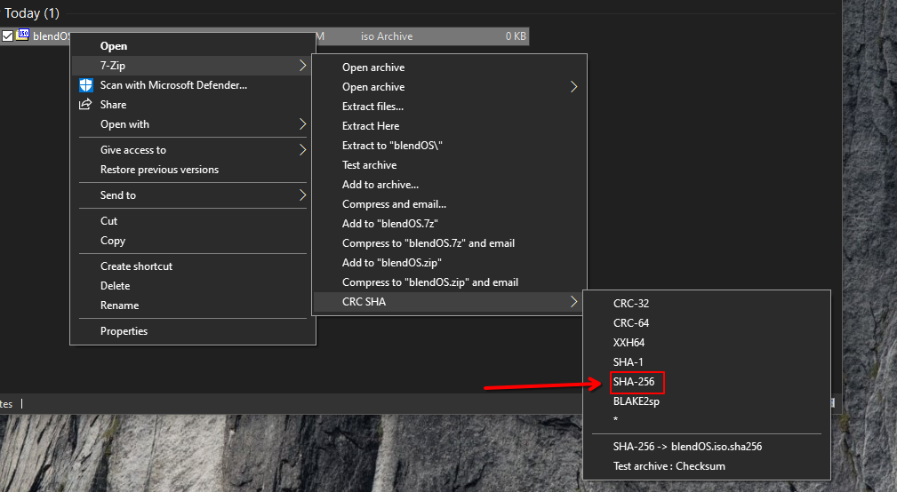

<style>
.md-typeset__table {
  width: 100%;
}

.md-typeset__table table:not([class]) {
  display: table
}

.md-content__button {
  display: none;
}

</style>

<div align="center" markdown> 
# :material-download: Download blendOS


## :simple-bittorrent: BitTorrent
<div class="notranslate" markdown>
[:material-file-download: Torrent](https://fosstorrents.com/thankyou/?name=blendos&cat=Latest%20Edition&id=0&hybrid=0){ .md-button target="_blank" rel="noopener noreferrer" data-umami-event="Torrent Download" }
</div>

<small>:fontawesome-solid-info:{ title="Info" } A webseed-capable client is **highly recommended**. A torrent client must be installed to open magnet links.</small>
{ .info }

## :material-lock: HTTPS

</div>

!!! info "Versions"
    To tell which mirrors are up-to-date, check which mirrors have the latest version <span id="v" class="noJs"></span>. All mirrors with the same version are up-to-date. If you don't see a version, something is wrong. Mirrors with an :x:{title=""} have not updated to the new version system.

    If you have been to this site before, you should do a **cacheless reload (++cmd++/++ctrl+shift+r++)** to ensure you're actually seeing the correct versions.

    <noscript>**Since you have Javascript disabled, you will need to check manually by clicking the `Version` link under each download button.**</noscript>

??? success "Verifying the ISO"
    
    First, download [the correct checksum](https://git.blendos.co/api/v4/projects/32/jobs/artifacts/main/raw/checksum?job=build-job){ target="_blank" rel="noopener noreferrer" } from the build server (it's a text document with the SHA256 checksum inside).

    Then, get the checksum of the ISO you downloaded:

    !!! note "The build server (Gitlab) ISO *will* have a different checksum due to compression (we're fixing this), but the risk of tampering is low considering it's where the ISO is built."

    === ":material-microsoft-windows: Windows"
        Open your terminal of choice (i.e. `cmd`) and type the following:
        
        ```batch
        certutil -hashfile C:\PATH\TO\YOUR\ISO SHA256
        ```

        If you have [7-zip](https://7-zip.org){ target="_blank" rel="noopener noreferrer" } or a fork of it, you can do this graphically:

        { width=550 }
    === ":material-apple: MacOS"
        Open **Terminal** (Launchpad > Utilities) and type the following:

        ```
        shasum -a 256 path/to/your/iso
        ```
    === ":fontawesome-brands-linux: Linux"
        Open a terminal and type the following:

        ```sh
        sha256sum path/to/your/iso
        ```

        or

        ```
        shasum -a 256 path/to/your/iso
        ```

    ---
    
    Now compare the checksum you're shown and the correct checksum in the file you downloaded earlier. Are they the same? 
    
    - If they are, your ISO is fine. **Continue with installation.**
    - If aren't, your ISO is either corrupt or was tampered with. **Delete it and use another mirror.**

<script>
var xhr6 = new XMLHttpRequest();
var fileUrl6 = 'https://git.blendos.co/api/v4/projects/32/jobs/artifacts/main/raw/version?job=build-job';
xhr6.open('GET', fileUrl6, true);
xhr6.onreadystatechange = function() {
  if (xhr6.readyState === XMLHttpRequest.DONE) {
    if (xhr6.status >= 200 && xhr6.status < 300) {
      var fileContent6 = xhr6.responseText;
      var numCharacters6 = 8; // Change this number as needed
      var firstCharacters6 = fileContent6.slice(0, numCharacters6);
      document.getElementById('v').innerHTML = "<b>(<a href='https://git.blendos.co/blendOS/image-builder/-/commit/" + fileContent6 + "' target='_blank' rel='noopener noreferrer'><code>" + firstCharacters6 + "</code></a>)</b>";
    } else {
      console.error('Failed to load file:', xhr6.statusText);
    }
  }
};
xhr6.onerror = function() {
  console.error('Network error occurred');
};
xhr6.send();
</script>

--8<-- "docs/download/mirrors.md"
