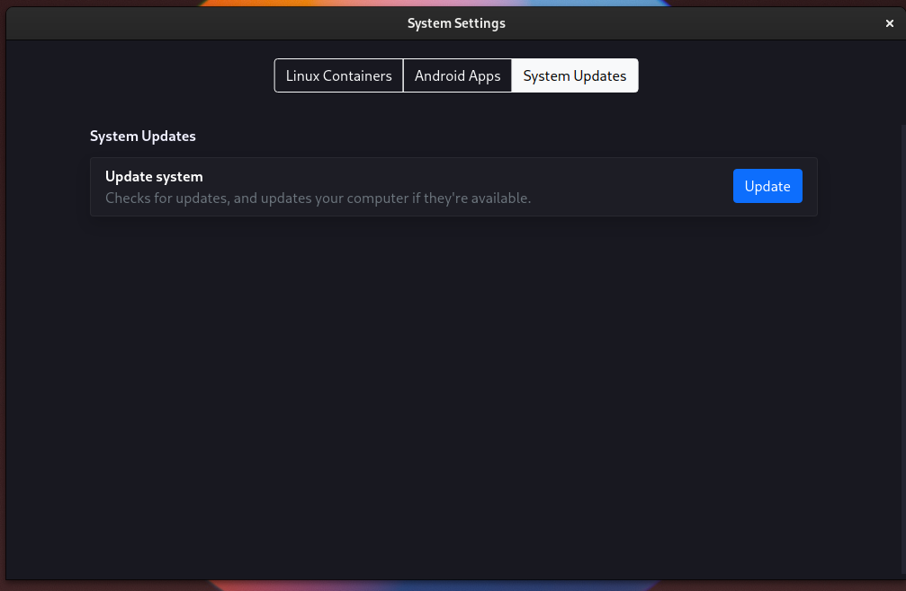

# :material-chat-question: FAQ

## What desktops are officially supported?

- GNOME ({{ track("default-gnome") }} track)
- KDE Plasma ({{ track("plasma") }} track)
- XFCE ({{ track("xfce") }} track)
- Cinnamon ({{ track("cinnamon") }} track)
- MATE ({{ track("mate") }} track)
- LXQt ({{ track("lxqt") }} track)

You can [make your own tracks](reference/configs/system.md#tracks) to support whatever desktop or WM you want, this is just what we offer by default.

## Why can't I use another init system?

blendOS relies heavily on [`systemd-nspawn`](https://wiki.archlinux.org/title/Systemd-nspawn){ target="_blank" rel="noopener noreferrer" } for containers, which is like `chroot` but on steroids. It is included with the {{ archpkg('systemd') }} package on Arch.

## Why are my aliases not showing up on fish?

blendOS has a file in `/etc/profile.d` that tells POSIX-compliant shells (i.e. bash, zsh) where to find your container binaries. These shells source it by default and understand the format. Fish is not POSIX-compliant. All you have to do is add the following to your `~/.config/fish/config.fish`:

```fish
if status is-login
    exec bash -c "test -e /etc/profile.d/blend.sh && source /etc/profile.d/blend.sh;\
    exec fish"
end
```

## What should go on the host?

Things like:

- Drivers
- Game Launchers (as a flatpak or a host package)
- Terminal emulators
- Web Browsers
- File managers
- Desktops/WMs
- Podman containers
- Anything that doesn't work in containers or as a flatpak

## What is updating?

It means to click the `Update` button in **System Settings**.



You can also run `sudo akshara update` in your terminal.

This should be done after editing [:material-file-star: `system.yaml`](reference/configs/system.md).

## Then how do I edit [`system.yaml`](reference/configs/system.md)?

Open your favorite text editor as root:

```sh
# GNOME
sudo gnome-text-editor /system.yaml

# KDE
sudo kate /system.yaml

# CLI editors
sudo nano /system.yaml

sudo micro /system.yaml
```

Make your edits, save, and update.

See [the reference](reference/configs/system.md) for details.

## I need to switch to X11!

!!! info "Only the {{ track("plasma") }} and {{ track("default-gnome") }}/{{ track("gnome") }} tracks use Wayland."

!!! warning "Android support will no longer work after switching."

First, install Xorg and update:

```yaml title="system.yaml"
packages:
  - xorg
```

Then, change your session to X11 depending on your desktop:

### :material-gnome: GNOME (GDM)

There is a cog in the bottom right. Click it and choose `GNOME on Xorg`.

### :simple-kde: KDE (SDDM)

In the bottom left there is a session selector. Click it and choose `Plasma (X11)`.

