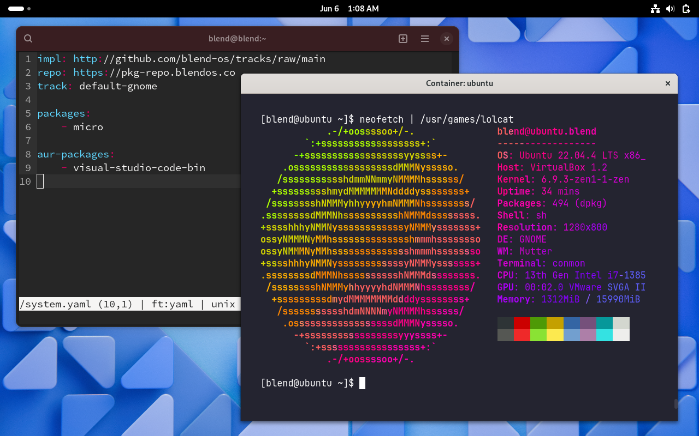

{ #blendos-logo width=100px }

<h1 style="margin-bottom: 0.2em;" id="blendos-title">blendOS</h1>

--------

<em>**Arch Linux made declarative, immutable and atomic. With Android app support and Fedora, Debian, CentOS Stream and Ubuntu containers available, as well as system packages/DEs/kernels from Arch Linux and the AUR.**</em>

<the-fold></the-fold>

<!-- 
<figure markdown="span">
  { width="720" }
  <figcaption></figcaption>
</figure>
-->

<!-- <em>**Beautiful.** **Efficient.** **Elegant.**</em> -->

[:material-hammer-wrench: Install blendOS](install/README.md){ .md-button .mt-1 data-umami-event="Install Button" } [:material-cog: Intro to blendOS](install/post-install/intro.md){ .md-button .mt-1 data-umami-event="Introduction for Arch users" }

------

-   :material-file-code:{ .lg .middle } __Declarative__

    ---

    blendOS v4 is fully declarative, allowing you to use custom packages, kernels, drivers and desktop environments on a minimal, atomic Arch Linux base system.

-   :material-arrow-up-bold-hexagon-outline:{ .lg .middle } __Atomic__

    ---

    Unlike most other operating systems, blendOS ensures your system does not end up in a half-broken state by replacing your old root filesystem with a new one cleanly.

-   :material-account:{ .lg .middle } __Friendly__

    ---

    Thanks to its immutable nature, blendOS prevents you from wrecking your system if you were to try to delete system directories, and makes troubleshooting issues intuitive for any user.

-   :material-puzzle:{ .lg .middle } __Extensible__

    ---

    blendOS offers support for applications and binaries from several distributions and Android, without the fear of breaking your system through the use of `podman` containers.

------

<em>**Flatpak** applications are supported out-of-the-box, and so are Arch Linux & AUR packages through the `/system.yaml` file. Support for applications from **Android**, **Fedora**, **Ubuntu**, **Debian** and **CentOS Stream** can be enabled through the System app on blendOS.</em>

<!-- <b><h2>Written by:</h2></b> -->
