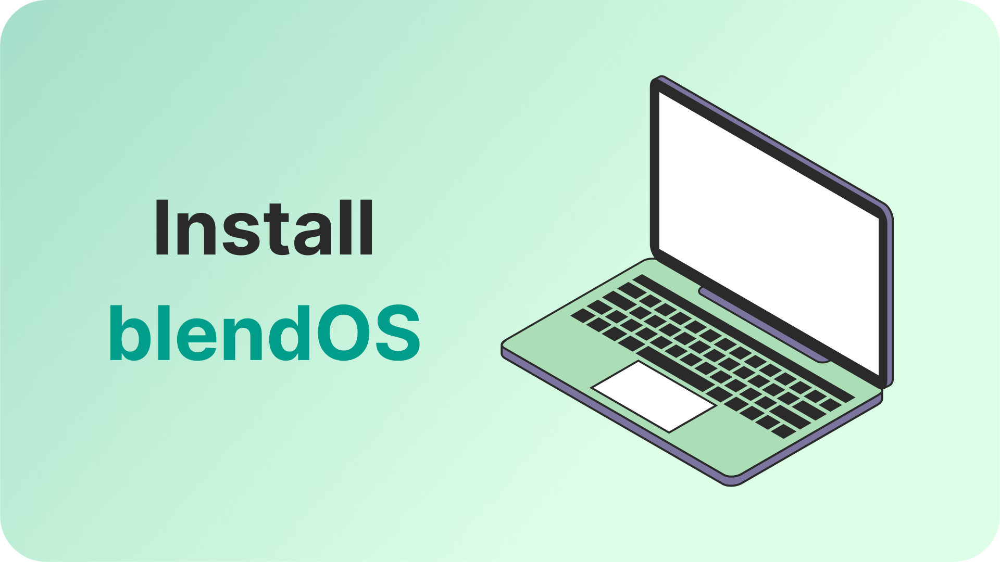
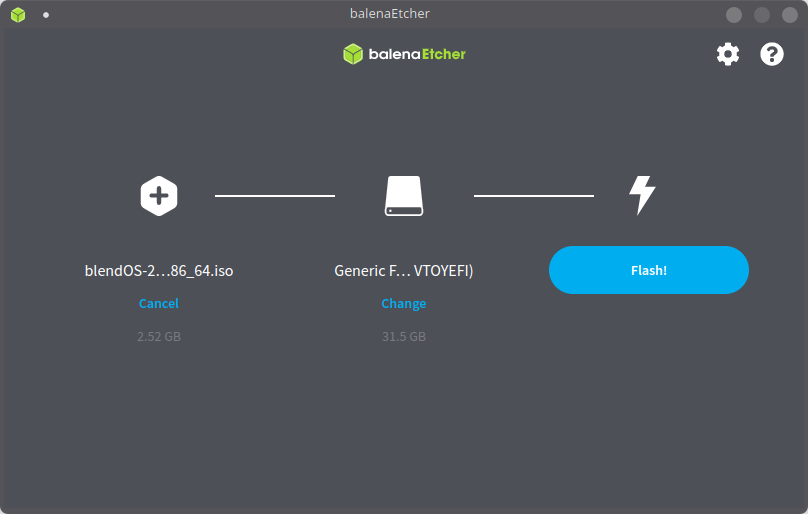
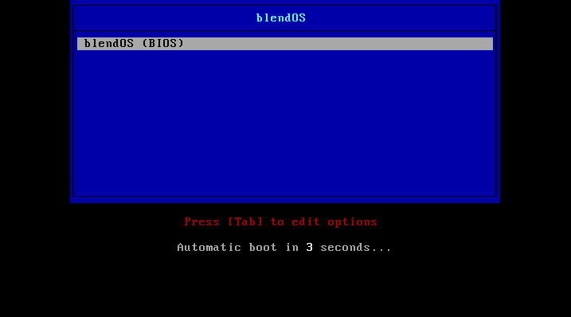
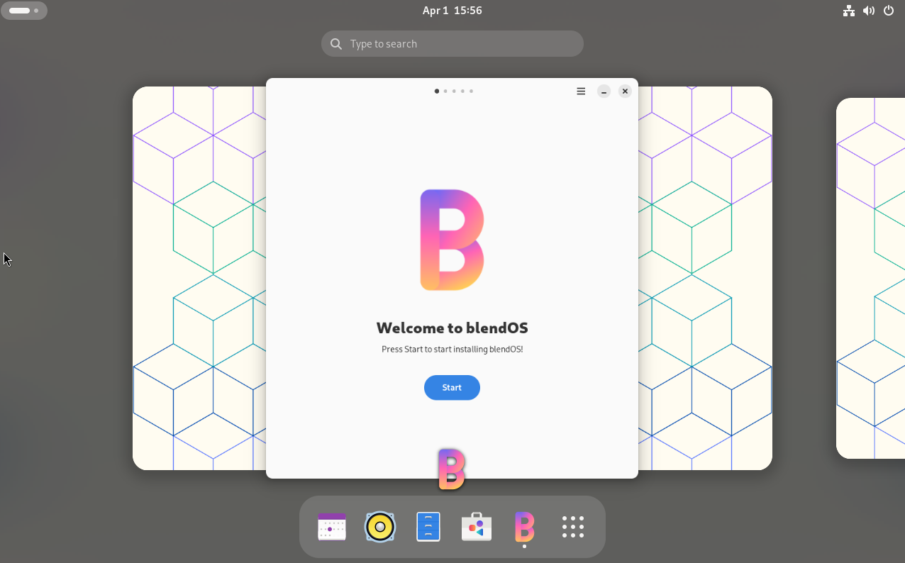
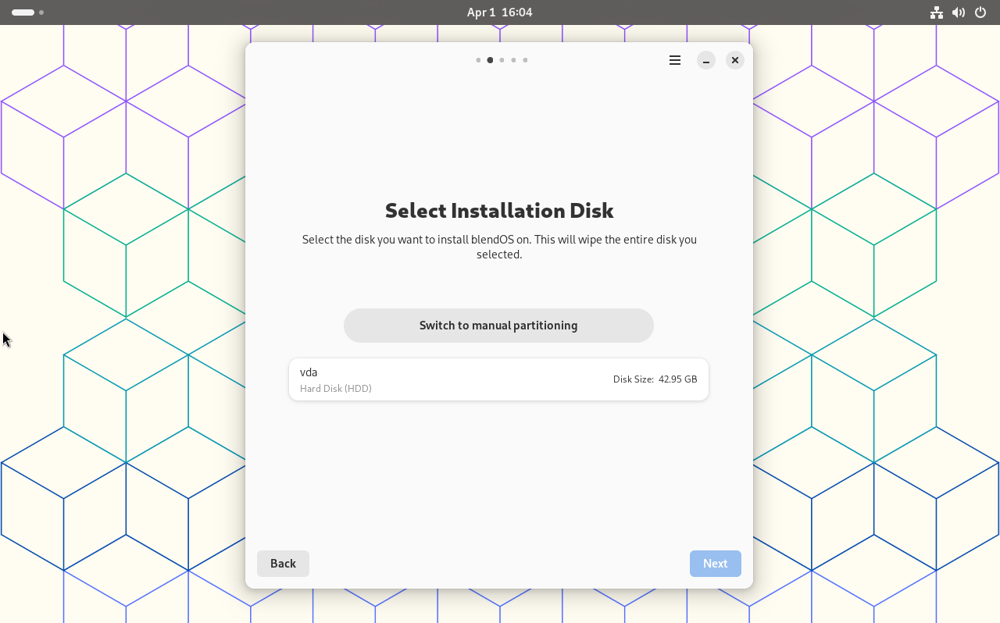
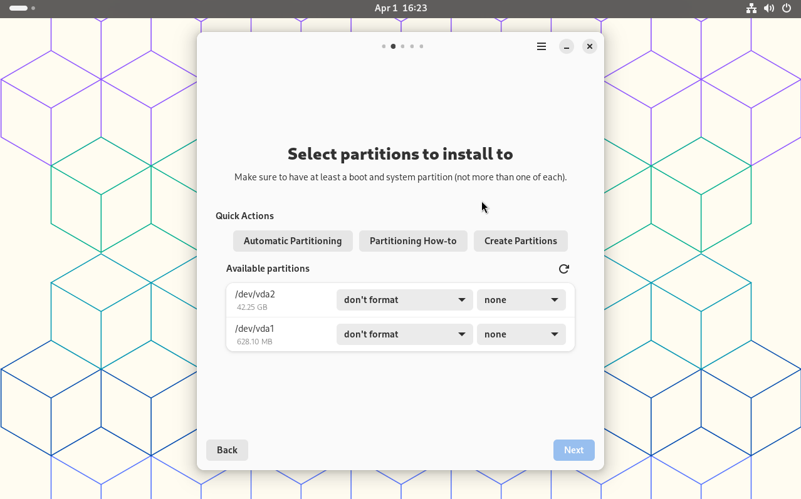

# :material-laptop: Normal PC

<figure markdown="span">
  { width="1000" }
  <figcaption></figcaption>
</figure>

------

## :material-clipboard-list-outline: Requirements

!!! question inline end "How can I check if I'm 64-bit?"
    **:material-microsoft-windows: Windows**:
    Consult [Microsoft's guide](https://support.microsoft.com/en-us/windows/which-version-of-windows-operating-system-am-i-running-628bec99-476a-2c13-5296-9dd081cdd808).

    **:material-apple: MacOS**: Click the :material-apple: and choose **About This Mac**. Anything other than *Intel Core Solo* or *Intel Core Duo* under **CPU** is **64-bit**.

    **:simple-linux: Linux**:
    Run `#!bash getconf LONG_BIT` in a terminal. The resulting number should be **64**.

- :material-cpu-64-bit: A <span class="red" title="Required">**64-bit**</span> CPU, from no earlier than <span class="orange" title="Recommended">2009</span>.
- :fontawesome-solid-memory: A minimum of <span class="orange" title="Recommended">4 GBs</span> of RAM and <span class="red" title="Required">**25 GBs**</span> of storage.
- :material-usb-flash-drive: A spare USB drive, with a minimum size of <span class="red" title="Required">**4GBs**</span>.
- :material-lan: A <span class="red" title="Required">**network connection**</span>, for the installer
- :material-clock: Time
- :material-file-code: (**Optional**{ .blue }) Basic YAML knowledge

## :material-package-down: Download blendOS

You can get the current v4 testing edition from the following mirrors:

| :material-map-marker: Location          | :material-format-letter-case: Name |               :material-speedometer: Bandwidth               |             :material-sitemap: CDN              |                                                                         :material-link: URL                                                                          |
| --------------------------------------- | :--------------------------------: | :----------------------------------------------------------: | :---------------------------------------------: | :------------------------------------------------------------------------------------------------------------------------------------------------------------------: |
| :globe_with_meridians:{title=""} Global |            Google Drive            |                Unlimited { data-sort='999' }                 | :octicons-check-16:{ .green } { data-sort='1' } |    [:material-download: Download](https://drive.google.com/file/d/1Paf7mR2t_hw-eC5a3li4Umm02HV40TOf/view){ target="_blank" rel="noopener noreferrer" .md-button }    |
| :globe_with_meridians:{title=""} Global |                MEGA                |                Unlimited { data-sort='999' }                 | :octicons-check-16:{ .green } { data-sort='1' } |  [:material-download: Download](https://mega.nz/file/zEgnDDJY#m2S7tzufQFnjdvjaNTrLas-cNVqxbFYbGAXN_bMj_ao){ target="_blank" rel="noopener noreferrer" .md-button }   |
| :flag_us:{title=""} United States       |              Otus9051              |                  10Gbps { data-sort='10' }                   |    :octicons-x-12:{ .red } { data-sort='0' }    | [:material-download: Download](https://kc1.mirrors.199693.xyz/blend/isos/testing/blendos-20240310-x8664.iso){ .md-button target="_blank" rel="noopener noreferrer" } |
| :flag_de:{title=""} Germany             |             Sahilister             |                   1Gbps { data-sort='1' }                    |    :octicons-x-12:{ .red } { data-sort='0' }    |                [:material-download: Download](https://mirrors.sahilister.in/blendos/testing/blendos-20240310-x8664.iso){ .md-button target="_blank" }                |
| :flag_de:{title=""} Germany             |               ico277               | :material-approximately-equal:0.5-12Gbps { data-sort='0.5' } |             :octicons-x-12:{ .red }             |     [:material-download: Download](https://mirror.ico277.xyz/blendos/testing/blendos-20240310-x8664.iso){ .md-button target="_blank" rel="noopener noreferrer" }     |
| :flag_ca:{title=""} Canada              |           AsteriskCloud            |                  0.2Gbps {data-sort='0.2'}                   |             :octicons-x-12:{ .red }             |                  [:material-download: Download](https://blend.asterisk.lol/dvd/testing/blendOS-2024.03.10-x86_64.iso){ .md-button target="_blank"}                   |

<small>We also have a [:fontawesome-solid-magnet: Magnet](magnet:?xt=urn:btih:cd1f5df0d6fff42a6aa7096c7696a7e535bfd2a2&dn=blendos-20240310-x8664.iso&tr=udp%3A%2F%2Ftracker.opentrackr.org%3A1337%2Fannounce&tr=udp%3A%2F%2Ffosstorrents.com%3A6969%2Fannounce&tr=http%3A%2F%2Ffosstorrents.com%3A6969%2Fannounce&tr=udp%3A%2F%2Ftracker.openbittorrent.com%3A6969%2Fannounce&tr=http%3A%2F%2Ftracker.openbittorrent.com%3A80%2Fannounce&tr=udp%3A%2F%2Ftracker.torrent.eu.org%3A451%2Fannounce&ws=https%3A%2F%2Fmirrors.sahilister.in%2Fblendos%2Ftesting%2Fblendos-20240310-x8664.iso&ws=https%3A%2F%2Fqiwi.lol%2Fb8Mn0216-blendOS-2024.iso&ws=http%3A%2F%2Ffosstorrents.com%2Fdirect-links%2Fblendos-20240310-x8664.iso){ title="From FossTorrents" rel="noopener noreferrer" } link available from our [FossTorrents](https://fosstorrents.com/distributions/blendos/){ target="_blank" } page.</small>

## :material-lightning-bolt: Flash a USB


=== ":octicons-star-fill-16:{ .yellow } Etcher"
    Download Etcher from https://etcher.io and plug in your USB.
    
    You can click the button below to automatically download and flash the ISO:

    [](https://efp.balena.io/open-image-url?imageUrl=https://kc1.mirrors.199693.xyz/blend/isos/testing/blendos-20240310-x8664.iso){ target="_blank" rel="noopener noreferrer" }

    If you already have an ISO, pick your downloaded ISO, your USB drive, and hit `Flash!`.

    

=== "Rufus (DD mode)"

    Open your ISO in Rufus, and hit `START`. When prompted, choose **DD Mode**!
=== "DD"
    Open a terminal and type the following:

    ```sh
    sudo dd if="path_to_blendos.iso" of="/dev/sdX" bs=4M status=progress
    ```

    Replace `/dev/sdX` with your USB's identifier (found via `lsblk`)
------

## :material-package-variant: Install blendOS

Now we can get on to actually installing this distro.

### :material-power: Boot the USB

First, find your **one-time boot** key. You can do this by searching:

- `<YOUR_MOTHERBOARD_MANUFACTURER_HERE> one-time boot key`

or

- `<YOUR_MOTHERBOARD_MANUFACTURER_HERE> bios setup key`

<small markdown><span class="tip">:octicons-light-bulb-16: **Tip:** Common boot keys include: ++f12++, ++esc++, ++f2++, ++f10++ and ++f11++. </span></small>

Plug your USB in and spam that key while turning on your PC.

You should see a device list, choose your USB device. It will be listed under its brand name or as `EFI USB device`. If you get booted to a diagnostic screen or get a "secure boot violation" error, see the below abstract.

If you see a sort of settings menu, go to the Boot section, and change the boot order so that your USB drive is at the top.

??? abstract "Disabling Secure Boot"
    Enter your BIOS setup and find a section called **Secure Boot** (or if it doesn't exist, look under **Boot**). Turn **Secure Boot** (also called **UEFI Secure Boot**) off.

    -----
    If you want to know what Secure Boot is, see [Microsoft's article on it](https://learn.microsoft.com/en-us/windows-hardware/design/device-experiences/oem-secure-boot).


If you're on **legacy BIOS**, you'll see a bootscreen, just press ++enter++. If you're on **UEFI** blendOS will just load.



Eventually the desktop will load and look something like this:



### :material-plus-circle: Running the installer

Click `Start`.

#### :material-harddisk: Disk

Once you start, you now need to choose your installation disk. 

You can either choose a disk (**<span class="red">:material-lightning-bolt:{ title="Danger" } THIS WIPES THE CHOSEN DISK AND ALL DATA ON IT!**</span>) or go to [**Manual Partitioning**](#manual-partitioning).



##### :material-harddisk-plus: Manual Partitioning

Oh, wait, Rudra wrote this guide for me  :expressionless:.



After clicking `Switch to Manual Partitioning`, choose `Partitioning How-To` under **Quick Actions**. This will explain exactly what to do.

A copy of the file that opens has been provided here for reference:

??? abstract "Partitioning How-To"

    ```
     ____            _   _ _   _             _             
    |  _ \ __ _ _ __| |_(_) |_(_) ___  _ __ (_)_ __   __ _ 
    | |_) / _` | '__| __| | __| |/ _ \| '_ \| | '_ \ / _` |
    |  __/ (_| | |  | |_| | |_| | (_) | | | | | | | | (_| |
    |_|   \__,_|_|   \__|_|\__|_|\___/|_| |_|_|_| |_|\__, |
                                                     |___/ 
     _   _                    _        
    | | | | _____      __    | |_ ___  
    | |_| |/ _ \ \ /\ / /____| __/ _ \       (CC-BY-SA 4.0)
    |  _  | (_) \ V  V /_____| || (_) |         (by rs2009)
    |_| |_|\___/ \_/\_/       \__\___/ 
                                       
    =======================================================
    
    This guide will cover different configurations, including
    users who want to install blendOS alongside Windows, as
    well as Linux users who would like to keep their existing
    Linux distribution and install blendOS alongside.
    
    =======================================================
    
       ____           _      ___         __                                    
      / __/__  ____  | | /| / (_)__  ___/ /__ _    _____   __ _____ ___ _______
     / _// _ \/ __/  | |/ |/ / / _ \/ _  / _ \ |/|/ (_-<  / // (_-</ -_) __(_-<
    /_/  \___/_/     |__/|__/_/_//_/\_,_/\___/__,__/___/  \_,_/___/\__/_/ /___/
    
    Do you want to replace your existing Windows installation
    with blendOS, or install blendOS alongside Windows without
    losing your files?
    
    If the former, follow the 'Automatic Partitioning' guide below; for
    the latter, you may follow the 'Manual Partitioning' guide underneath.
    
    +------------------------+
    + Automatic Partitioning +
    +------------------------+
    
    WARNING: Automatic partitioning will erase all files on your disk.
    
    1. Switch back to Automatic Partitioning.
    
    2. Select your main hard drive/SSD.
    
    3. Proceed to the next page, and continue with installation.
    
    +---------------------+
    + Manual Partitioning +
    +---------------------+
    
    1. Select 'Create Partitions'.
    
    2. Make sure your primary system drive is selected.
    
    3. Create a new partition of a size of 512MB, formatted as fat32.
    
    4. Create another partition of a size of at least 40GBs, formatted as ext4.
    
    5. Click on the tick above to apply the changes.
    
    6. Close the opened window, and reload the list of available partitions.
    
    7. Select the right-most dropdown for the 512MB partition, and select 'Boot'.
    
    8. Select the right-most dropdown for the other partition, and select 'System'.
    
    9. Voila! You may now proceed to the next page, and continue with installation.
    
    =======================================================
    
       ____           __   _                                     
      / __/__  ____  / /  (_)__  __ ____ __  __ _____ ___ _______
     / _// _ \/ __/ / /__/ / _ \/ // /\ \ / / // (_-</ -_) __(_-<
    /_/  \___/_/   /____/_/_//_/\_,_//_\_\  \_,_/___/\__/_/ /___/
    
    Do you want to replace your existing Linux installation
    with blendOS, or install blendOS alongside Linux without
    losing your files?
    
    If the former, follow the 'Automatic Partitioning' guide below; for
    the latter, you may follow the 'Manual Partitioning' guide underneath.
    
    +------------------------+
    + Automatic Partitioning +
    +------------------------+
    
    WARNING: Automatic partitioning will erase all files on your disk.
    
    1. Switch back to Automatic Partitioning.
    
    2. Select your main hard drive/SSD.
    
    3. Proceed to the next page, and continue with installation.
    
    +---------------------+
    + Manual Partitioning +
    +---------------------+
    
    1. Select 'Create Partitions'.
    
    2. Make sure your primary system drive is selected.
    
    3. Create a new partition of a size of 512MB, formatted as fat32.
    
    4. Create another partition of a size of at least 40GBs, formatted as ext4.
    
    5. Click on the tick above to apply the changes.
    
    6. Close the opened window, and reload the list of available partitions.
    
    7. Select the right-most dropdown for the 512MB partition, and select 'Boot'.
    
    8. Select the right-most dropdown for the other partition, and select 'System'.
    
    9. Voila! You may now proceed to the next page, and continue with installation.
    
    =======================================================
    
    Thanks for taking the time to read this entire guide!
    
    Author: Rudra Saraswat
    License: CC BY-SA 4.0 (https://creativecommons.org/licenses/by-sa/4.0/)
    ```
"Reloading the list of available partitions" means click that little refresh icon ({ .tweemoji .off-glb })

---------

You will see a summary and the installation will begin. Wait for first build to finish, then click `Next` and finally, `Reboot`.

??? failure "Troubleshooting: Downloads of certain packages fail or install keeps looping at pacman bit"
    This is probably due to the fact that our repo is down :pensive: Double check that it is up via our [status page](https://status.asterisk.lol/status/blendos){ target="_blank" rel="noopener noreferrer" }.

    If it is down, open a terminal in the live CD (:material-apps-box: > Utilities > Console) and type `sudo nano /system.yaml`. 
    ??? abstract "Nano controls"
        Arrow keys to move, everything else is the same as any other text editor. ++ctrl+o++ to save, ++ctrl+x++ to save and quit.
    Change `repo` to one of our **backup repos**:

    - `https://kc1.mirrors.199693.xyz/blend/`
    - `https://blend.asterisk.lol/mirror`
    
    Then hit ++ctrl+x++ to save. Try the install again.

## :material-power-on: First Boot

On first boot, a GNOME welcome window will open. From here, it's pretty self-explanatory. Set your language, keyboard, timezone, etc.

(picture of the first page of the gnome welcome window)

After you click `Start Using`, your desktop will open.

!!! success "blendOS is now installed!"

Now, continue with the [**:material-wrench: Post-Install**](post-install/README.md) section.