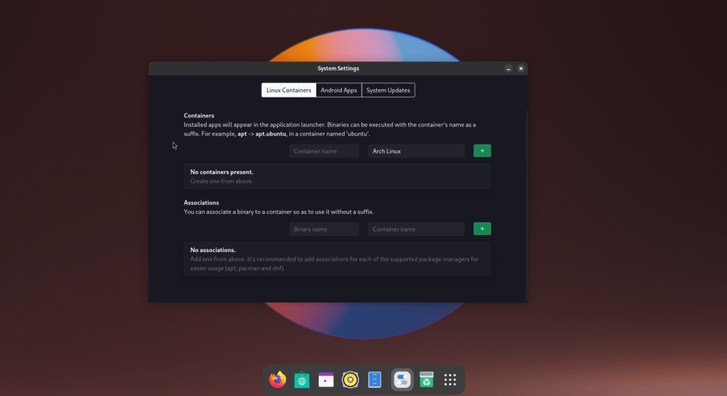
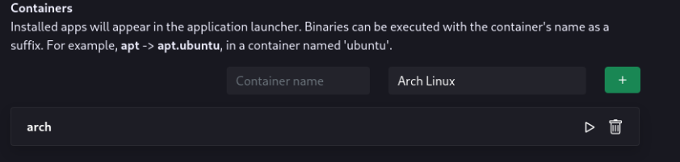

# :material-truck-cargo-container: Container Management

in blendOS, you manage containers from the **System** app (also known as **blendOS Settings**).

## :material-cursor-default-click: Usage

When you first open it, (:material-apps-box: > System) you will see a window like this:

### :material-train-car-container: Container creation

In the first tab (`Linux Containers`) you can create associations and Linux distro containers.

In the first box you can create and manage containers. Simply type the name and choose a distro.

Keep in mind the container name will influence the binary suffix, and it can be **whatever you want**. You could name your arch container `ar` so you can have a shorter binary suffix (i.e. `pacman.ar` instead of `pacman.arch`).

Once created, you will see your container, along with 2 options:

- :material-play-outline: Enter container shell
- :material-trash-can-outline: Delete container

*[binary suffix]: The part after a container binary, like .ubuntu for apt.ubuntu

### :octicons-arrow-switch-16: Associations

You can also create associations to remove annoying binary suffixes. Simply type the binary name and the container name.

## :material-android: Waydroid

