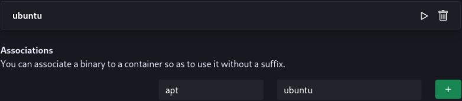

# :material-truck-cargo-container: Container Management

in blendOS, you manage containers from the **System** app (also known as **blendOS Settings**).

## :material-cursor-default-click: Usage

When you first open it, (:material-apps-box: > System) you will see a window like this:


### :material-train-car-container: Container creation

In the first tab (`Linux Containers`) you can create associations and Linux distro containers.

In the first box you can create and manage containers. Simply type the name and choose a distro.

Keep in mind the container name will influence the binary suffix, and it can be **whatever you want**. You could name your Ubuntu container `ub` so you can have a shorter binary suffix (i.e. `apt.ub` instead of `apt.ubuntu`).


Once created, you will see your container, along with 2 options:

- :material-play-outline: Enter container shell (you can also do this by typing `bash.<your container name>` in the terminal)
- :material-trash-can-outline: Delete container

*[binary suffix]: The part after a container binary, like .ubuntu for apt.ubuntu

You can also double click on Linux packages and Android APKs to open the blendOS **Package Installer**.


### :octicons-arrow-switch-16: Associations

You can also create associations to remove annoying binary suffixes. Simply type the binary name and the container name.



-----


## :material-android: Waydroid

Click `Initialize Waydroid`.

After Waydroid initializes, you will see options to install [**:simple-fdroid: F-Droid**](https://f-droid.org){ target="_blank" rel="noopener noreferrer" } or the [{ .tweemoji width=24 .off-glb .icon-blend-misc } **Aurora Store**](https://www.auroraoss.com/){ target="_blank" rel="noopener noreferrer" }. Click on them to install them. You will also see an option to open Waydroid settings.


!!! info "App Architecture"
    Waydroid only works with apps that have an architecture of `x86_64`.

    If you need to run an ARM app, you will need to install `libhoudini` or `libndk`.

    You can do this by setting the following in your [`system.yaml`](../../reference/configs/system.md):
    
    ??? question "`libhoudini` or `libndk`?"
        `libhoudini` is generally recommended for Intel CPUs, while `libndk` is generally recommended for AMD CPUs.

        However, some apps will work on one translation layer and not another. You may need to try both if a game does not work or suffers from bad performance.

    ```yaml title="system.yaml"
    [...] # Rest of file

    aur-packages:
      - 'waydroid-script-git'
    
    commands:
      - 'cd /opt/waydroid-script/ && waydroid-extras install libhoudini' # replace libhoudini with libndk if on an AMD CPU
    ```

??? abstract "ADB usage"
    After getting your Android IP from **Settings > About**, use this adb command:

    ```
    adb connect <IP>:5555
    ```

Some useful Waydroid CLI commands are:

| Command | Function |
| -------------------- | -------------------------------- |
| `waydroid show-full-ui` | Start a full Android session |
| `waydroid session stop` | Kills all waydroid windows and stops Waydroid from working |
| `waydroid session start` | Resumes Waydroid |
| `waydroid shell` | Android shell |
| `waydroid app install file.apk` | Mostly redundant with our package installer, but useful |
| `waydroid app launch com.foo.bar` | Open an Android app (you can also do this from your DE's app launcher) |
| `waydroid log` | Show the Waydroid log |


You can learn more about Waydroid and find more guides and commands at https://docs.waydro.id{ target="blank" rel="noopener noreferrer" }.

??? failure "I'm stuck in Waydroid!"
    If you see a weird transparent android homescreen or are generally stuck in Waydroid, hit your ++win++ key and try to open your terminal (:material-apps-box: > Utilities > Console in GNOME). From there, type `waydroid session stop` into it. This will close any and all Waydroid windows.

    You will need to run `waydroid session start` before using Waydroid again.

??? failure "Play-protected apps aren't launching!"
    See [the certification guide](https://docs.waydro.id/faq/google-play-certification){ target="_blank" rel="noopener noreferrer" }.

??? failure "Waydroid isn't working on my NVidia card!"
    [Disable GPU acceleration](https://docs.waydro.id/faq/get-waydroid-to-work-through-a-vm){ target="_blank" rel="noopener noreferrer" }.

## :material-refresh: System Rebuild

Clicking the `Update` button will start a rebuild of your system (same as `sudo akshara update`).

<div class="annotate" markdown>

??? failure "The update failed due to a timeout!"
    Our repo may be down, check the [status page](https://status.asterisk.lol/status/blendos){ target="_blank" rel="noopener" }.

    If it is down, edit the `repo` section of `system.yaml` to one of our backup repos (1):

    ```yaml title="system.yaml (Example)"
    repo: 'https://kc1.mirrors.199693.xyz/blend/'
    ```

    Then rerun the update.
</div>

1.    - :flag_us: https://kc1.mirrors.199693.xyz/blend/
      - :flag_ca: https://blend.asterisk.lol/mirror (slower)