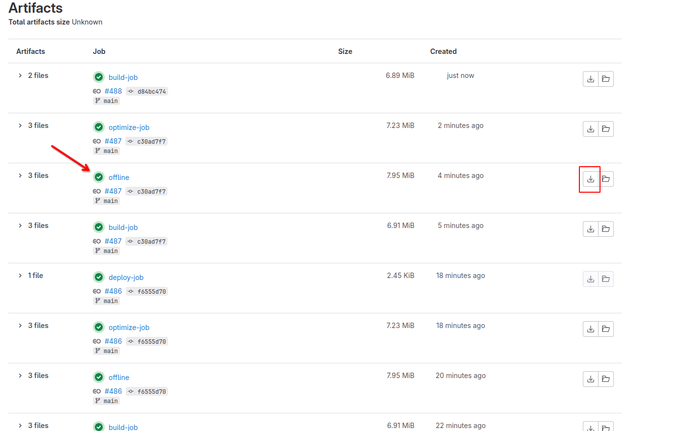

# :material-wifi-off: Offline Reading

You can download our docs for offline reading.

Simply visit this link: https://git.blendos.co/asterisk/blend-docs-material/-/artifacts{ target="_blank" rel="noopener noreferrer" }

Find the latest `offline` job and click the download button.

Open **artifacts.zip** and extract the `site` folder. Open `index.html` in your browser. 

**Happy reading!**
