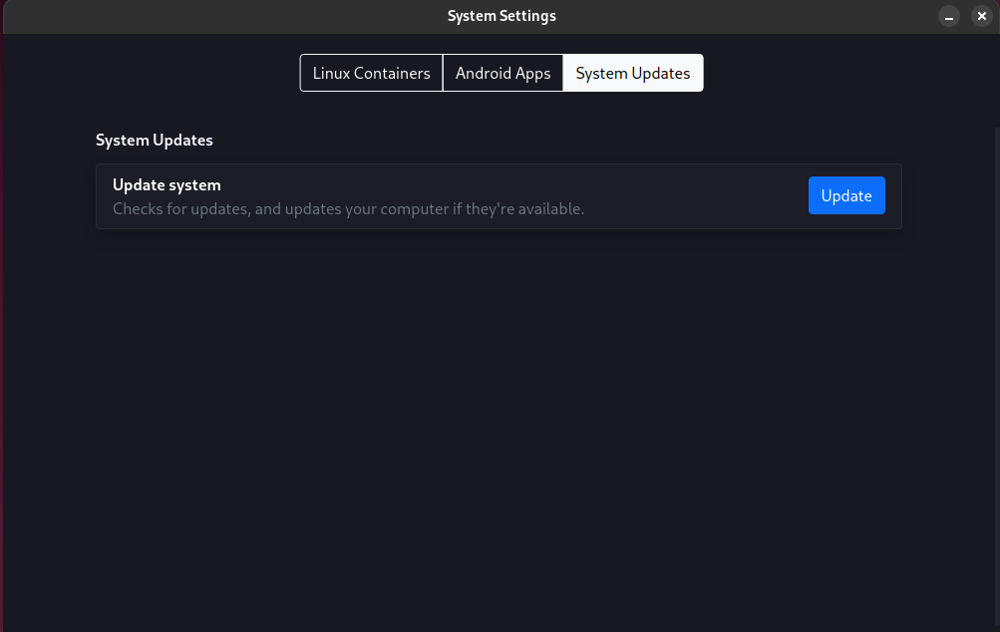

<div class="grid cards" markdown>

-   # :material-hard-hat: <span class="notranslate">akshara</span> { .off-glb }
    -------

    <em>The system builder.</em>

    !!! danger ""
        These docs cover v4's akshara. v3 akshara is quite different, and is not covered here.

    - Language: :misc-python:{ title=Python }
    - Size::material-approximately-equal:16.38 KB
    - GUI: :octicons-check-16:{ .green title="Yes, blend-settings" }
    - Comes with blendOS: :octicons-check-16:{ .green title="Yes" }

    --------
    ```title="Config file location"
    📁 /
    └── ⭐ system.yaml
    ```

    ------
    [:octicons-code-16: Source Code](https://git.blendos.co/blendOS/system-tools/akshara){ .md-button target="_blank" rel="noopener noreferrer" }

</div>

!!! question "What is <span class="notranslate">akshara</span>?"
    akshara is a tool for turning a config file (`system.yaml`) into a fully built system. It does this by parsing the config file and performing actions against an Arch rootfs tarball to create a new system, which [replaces your old one](../nerdy-stuff/atomicity.md) after a reboot (user folders, containers and Flatpaks are preserved).

## :material-clipboard-text: Reference

### :material-file-code: `system.yaml`

!!! info ""
    This reference has been moved to a [new page](../configs/system.md).

## :material-window-maximize: GUI

`akshara` has a GUI within `blend-settings`.



## :octicons-terminal-16: CLI

### :material-flag: Global flags

| Flag   | Description |
| -------- | ------- |
| `--keep-files-on-error` | Do not delete leftover files if there is an error. |
| `-v`/`--version`  | Print the version number |

### :fontawesome-solid-question: Help Page

```bash
akshara
```

Shows a help page.

### :material-refresh: Rebuild system

```bash
akshara update
```

Rebuild/update your system. You will need to reboot after this.
