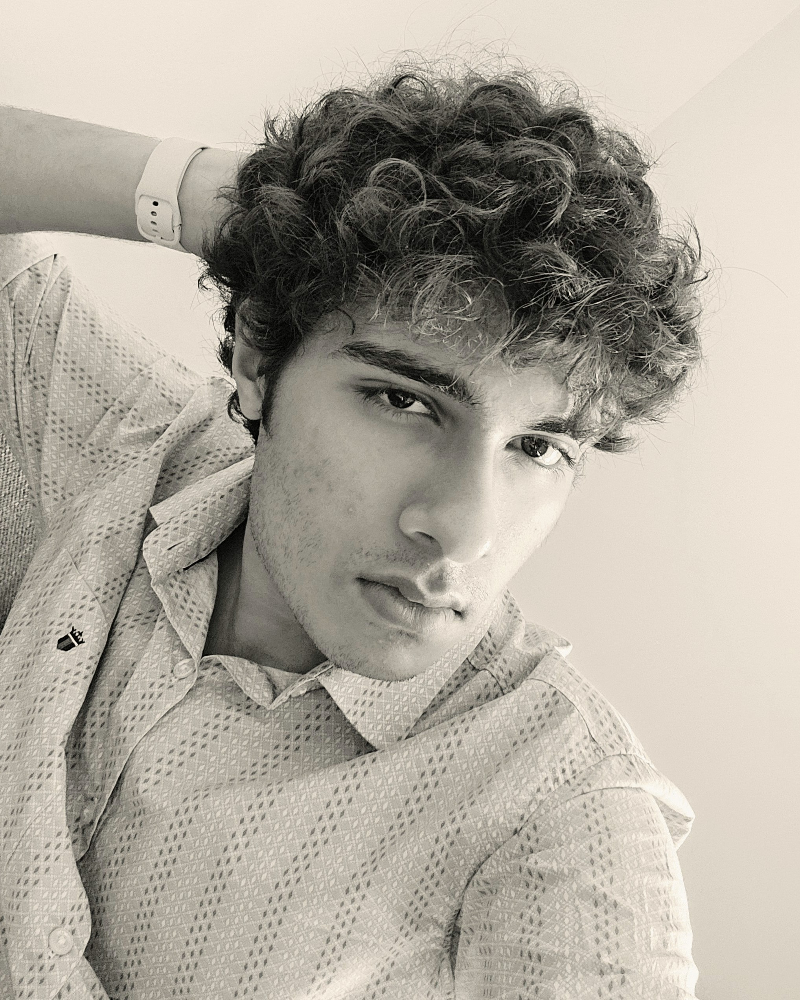

# Meet the team!

{ .circle width=200 height=50 }
 
[**Rudra Saraswat**](https://ruds.io/){ target="_blank" rel="noopener noreferrer" }
 
*Project Lead & Dev, creator of blendOS*

{ .circle width=200 }
 
[**Asterisk**](https://asterisk.lol){ target="_blank" rel="noopener" } ([:fontawesome-brands-mastodon:](https://social.linux.pizza/@asterisk){ target="_blank" rel="me noopener noreferrer"})
 
*Docs & Infrastructure*
  

{ .circle width=200 }
 
[**Askiiart**](https://askiiart.net){ target="_blank" rel="noopener noreferrer" }
 
*Maintenance Developer*
  

{ .circle width=200 }
 
[**Noa Himesaka**](https://noa.codes){ target="_blank" rel="noopener noreferrer" }
 
*T2 Branch Developer*

{ .circle width=200 }
 
[**Sven Kovač**](https://git.blendos.co/svgaming){ target="_blank" rel="noopener noreferrer" }
 
*Screenshots, `bpkg` Developer*
  

{ .circle width=200 }
 
[**Jaoheah**](https://github.com/Jaoheah){ target="_blank" rel="noopener noreferrer" }
 
*Community Manager & Infrastructure*

